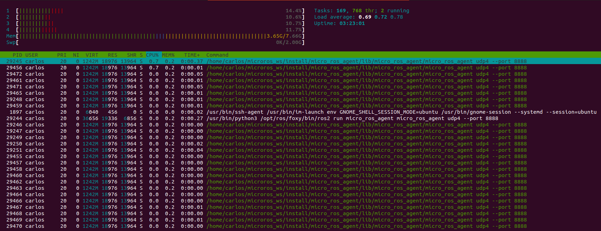

Anexos
======

Anexo 1: Muestra de resultados obtenidos
----------------------------------------

A continuación se expone una muestra de los resultados obtenidos
de los análisis realizados.

Latencia:

.. code-block:: bash

    Thread 0 Interval: 600
        0:       0:      12
        0:       1:       8
        0:       2:       7
        0:       3:       7
        0:       4:      10
        0:       5:       8
        0:       6:       8
        0:       7:       9
        0:       8:       7
        0:       9:       7
        0:      10:       7
        0:      11:       7
        0:      12:       7
        0:      13:       9
        0:      14:       7
        0:      15:       7
        0:      16:       9
        0:      17:       7
        0:      18:       7
        0:      19:       7
        0:      20:      10
        0:      21:       8
        0:      22:       7
        0:      23:       7
        0:      24:       7
        0:      25:       7
        0:      26:       9
        0:      27:       7
        0:      28:       7
        0:      29:       6

Throughput:

.. code-block:: bash

    ^[[35m[1635685759.599018]^[[m debug    | ^[[34mSerialAgentLinux.cpp^[[m | ^[[37msend_message            ^[[m | ^[[33m[** <<SER>> **]^[[m        | client_key: 0x262A35A2, len: 13
    ^[[35m[1635685760.051717]^[[m debug    | ^[[34mSerialAgentLinux.cpp^[[m | ^[[37mrecv_message            ^[[m | ^[[33m[==>> SER <<==]^[[m        | client_key: 0x262A35A2, len: 508
    ^[[35m[1635685760.051991]^[[m debug    | ^[[34mSerialAgentLinux.cpp^[[m | ^[[37msend_message            ^[[m | ^[[33m[** <<SER>> **]^[[m        | client_key: 0x262A35A2, len: 13
    ^[[35m[1635685760.095816]^[[m debug    | ^[[34mSerialAgentLinux.cpp^[[m | ^[[37mrecv_message            ^[[m | ^[[33m[==>> SER <<==]^[[m        | client_key: 0x262A35A2, len: 508
    ^[[35m[1635685760.096039]^[[m debug    | ^[[34mSerialAgentLinux.cpp^[[m | ^[[37msend_message            ^[[m | ^[[33m[** <<SER>> **]^[[m        | client_key: 0x262A35A2, len: 13
    ^[[35m[1635685760.097978]^[[m debug    | ^[[34mSerialAgentLinux.cpp^[[m | ^[[37mrecv_message            ^[[m | ^[[33m[==>> SER <<==]^[[m        | client_key: 0x262A35A2, len: 52
    ^[[35m[1635685760.098142]^[[m debug    | ^[[34mDataWriter.cpp    ^[[m | ^[[37mwrite                   ^[[m | ^[[33m[** <<DDS>> **]^[[m        | client_key: 0x00000000, len: 1033
    ^[[35m[1635685760.098277]^[[m debug    | ^[[34mSerialAgentLinux.cpp^[[m | ^[[37msend_message            ^[[m | ^[[33m[** <<SER>> **]^[[m        | client_key: 0x262A35A2, len: 13
    ^[[35m[1635685760.552689]^[[m debug    | ^[[34mSerialAgentLinux.cpp^[[m | ^[[37mrecv_message            ^[[m | ^[[33m[==>> SER <<==]^[[m        | client_key: 0x262A35A2, len: 508
    ^[[35m[1635685760.552845]^[[m debug    | ^[[34mSerialAgentLinux.cpp^[[m | ^[[37msend_message            ^[[m | ^[[33m[** <<SER>> **]^[[m        | client_key: 0x262A35A2, len: 13
    ^[[35m[1635685760.596692]^[[m debug    | ^[[34mSerialAgentLinux.cpp^[[m | ^[[37mrecv_message            ^[[m | ^[[33m[==>> SER <<==]^[[m        | client_key: 0x262A35A2, len: 508
    ^[[35m[1635685760.596904]^[[m debug    | ^[[34mSerialAgentLinux.cpp^[[m | ^[[37msend_message            ^[[m | ^[[33m[** <<SER>> **]^[[m        | client_key: 0x262A35A2, len: 13
    ^[[35m[1635685760.599166]^[[m debug    | ^[[34mSerialAgentLinux.cpp^[[m | ^[[37mrecv_message            ^[[m | ^[[33m[==>> SER <<==]^[[m        | client_key: 0x262A35A2, len: 52
    ^[[35m[1635685760.599352]^[[m debug    | ^[[34mDataWriter.cpp    ^[[m | ^[[37mwrite                   ^[[m | ^[[33m[** <<DDS>> **]^[[m        | client_key: 0x00000000, len: 1033
    ^[[35m[1635685760.599486]^[[m debug    | ^[[34mSerialAgentLinux.cpp^[[m | ^[[37msend_message            ^[[m | ^[[33m[** <<SER>> **]^[[m        | client_key: 0x262A35A2, len: 13
    ^[[35m[1635685761.057626]^[[m debug    | ^[[34mSerialAgentLinux.cpp^[[m | ^[[37mrecv_message            ^[[m | ^[[33m[==>> SER <<==]^[[m        | client_key: 0x262A35A2, len: 508
    ^[[35m[1635685761.057882]^[[m debug    | ^[[34mSerialAgentLinux.cpp^[[m | ^[[37msend_message            ^[[m | ^[[33m[** <<SER>> **]^[[m        | client_key: 0x262A35A2, len: 13
    ^[[35m[1635685761.102167]^[[m debug    | ^[[34mSerialAgentLinux.cpp^[[m | ^[[37mrecv_message            ^[[m | ^[[33m[==>> SER <<==]^[[m        | client_key: 0x262A35A2, len: 508
    ^[[35m[1635685761.102401]^[[m debug    | ^[[34mSerialAgentLinux.cpp^[[m | ^[[37msend_message            ^[[m | ^[[33m[** <<SER>> **]^[[m        | client_key: 0x262A35A2, len: 13
    ^[[35m[1635685761.104181]^[[m debug    | ^[[34mSerialAgentLinux.cpp^[[m | ^[[37mrecv_message            ^[[m | ^[[33m[==>> SER <<==]^[[m        | client_key: 0x262A35A2, len: 52
    ^[[35m[1635685761.104368]^[[m debug    | ^[[34mDataWriter.cpp    ^[[m | ^[[37mwrite                   ^[[m | ^[[33m[** <<DDS>> **]^[[m        | client_key: 0x00000000, len: 1033

.. raw:: latex

    \newpage

Consumo de memoria:

    
    Resultados de "htop" al ejecutar la aplicación

.. raw:: latex

    \newpage

Anexo 2: Script de python para la generación de gráficas
--------------------------------------------------------

.. code:: python

    from gc import collect
    import seaborn as sns
    import pandas as pd
    import numpy as np
    import matplotlib.pyplot as plt

    sns.set_theme(style="darkgrid")

    def gen_plot_for_latency(data_file):
        df = pd.read_csv(
            data_file + ".dat",
            skiprows=3,
            delimiter=r":\s+",
            header=None,
            usecols=[2],
            names=["latency"],
            engine="python",
        )

        latency_df = df.drop(df[df.latency < 4].index)

        sns.displot(data=latency_df, x="latency", kind="kde")
        plt.savefig(data_file + "_dist_kde.png", dpi=300)

        sns.histplot(data=latency_df, x="latency", discrete=True)
        plt.savefig(data_file + "_hist.png", dpi=300)

    def gen_plot_for_tp(data_info, axes):
        data_file, description, fil, col = data_info
        df = pd.read_csv(data_file + ".dat", delimiter=r"\s+")
        rel = sns.relplot(
            ax=axes[fil, col],
            x="Frequency",
            y="Throughput",
            data=df,
            kind="line",
            marker="o",
        )
        plt.xscale("log", base=2)
        plt.savefig(data_file + ".png", dpi=300)

    data_files = [
        "latency_serial_best-effort",
        "latency_serial_reliable",
        "latency_wifi_best-effort",
        "latency_wifi_reliable",
        "latency_best_effort_Wi-Fi_interference",
        "latency_reliable_Wi-Fi_interference",
    ]

    for data_file in data_files:
        gen_plot_for_latency(data_file)

    data_infos = [
        ("throughput_serial_best_effort", "Conexión en serie, modo best-effort", 0, 0),
        ("throughput_serial_reliable", "Conexión en serie, modo reliable", 0, 1),
        ("throughput_wifi_best_effort", "Conexión Wi-Fi, modo best-effort", 1, 0),
        ("throughput_wifi_reliable", "Conexión Wi-Fi, modo reliable", 1, 1),
    ]

    for data_info in data_infos:
        fig, axes = plt.subplots(2, 2)
        gen_plot_for_tp(data_info, axes)

.. raw:: latex

    \newpage

Anexo 3: Acrónimos
------------------

- ROS: Sistema operativo de robots

- IoT: Internet de las cosas

- RTOS: Sistema operativo en tiemo real

- Framework: Entorno de trabajo

- Firmware: Programa que controla los circuitos electrónicos de un dispositivo

- Middleware: Software intermedio entre dispositivos y plataformas de software

- Throughput: Tasa de transferencia efectiva

- Topic: Tópico del mensaje

- Publisher: Editor de un topic

- Subscriber: Suscriptor de un topic

- API: Interfaz de programación de aplicaciones

- DDS: Servicio de distribución de datos

- XRCE: Entorno de recursos extremadamente limitados

- UDP: Protocolo de datagrama de usuario

- TCP: Protocolo de control de transmisión

- POSIX: Interfaz de sistema operativo portable

- OTT: Servicios de libre transmisión

- UART: Transmisor-Receptor Asíncrono Universal

- MIMO: Múltiple entrada, múltiple salida

.. raw:: latex

    \newpage

Anexo 4: Inciencias ocurridas
-----------------------------

Durante la preparación de los análisis ha sido necesario realizar
numerosas pruebas intermedias que asegurasen el correcto funcionamiento
del hardware y de los middlewares. En la ejecución de estas pruebas
se han encontrado varias incidencias que han ralentizado la realización
del ejercicio.

Conexión Wi-Fi
++++++++++++++

En primer lugar, surgió un percance durante el intento de realizar
una primera conexión vía Wi-Fi. Una vez configurado el firmware para
que se conectase a la IP de la red elegida, tras flashear el firmware
en el dispositivo, el punto de acceso Wi-Fi no lo detectaba. Se utilizó
entonces el siguiente comando para depurar el problema:

.. code-block:: bash
 
 ros2 run micro_ros_setup build_firmware.sh monitor

Obteniendo la siguiente información relevante:

.. code-block:: bash

    I (642) wifi station: ESP_WIFI_MODE_STA
    I (662) wifi:wifi driver task: 3ffc4398, prio:23, stack:6656, core=0
    I (662) system_api: Base MAC address is not set, read default base MAC address from BLK0 of EFUSE
    I (662) system_api: Base MAC address is not set, read default base MAC address from BLK0 of EFUSE
    I (692) wifi:wifi firmware version: 3ea4c76
    I (692) wifi:config NVS flash: enabled
    I (692) wifi:config nano formating: disabled
    I (692) wifi:Init dynamic tx buffer num: 32
    I (702) wifi:Init data frame dynamic rx buffer num: 32
    I (702) wifi:Init management frame dynamic rx buffer num: 32
    I (712) wifi:Init management short buffer num: 32
    I (712) wifi:Init static rx buffer size: 1600
    I (712) wifi:Init static rx buffer num: 10
    I (722) wifi:Init dynamic rx buffer num: 32

    Brownout detector was triggered

Investigando el último mensaje de error “Brownout detector was triggered”, 
se descubrió que la incidencia estaba relacionada con la falta de potencia en 
la alimentación de la placa. :footcite:`brownout_detector_was_triggered` 

En una primera instancia se trató de modificar la fuente de alimentación,
cambiando en primer lugar de puerto en el ordenador y, posteriormente,
conectando la placa directamente a la red de alimentación doméstica. En
ambos casos no se consiguió establecer la conexión Wi-Fi, manteniéndose el
mismo error en la salida del terminal. Posteriormente se detectó que la
incidencia residía en el cable micro-USB escogido inicialmente. Este no
conseguía aportar toda la potencia que requiere la placa para establecer
una conexión Wi-Fi, ya que esta función demanda una mayor cantidad de energía
frente a otras como puede ser la conexión en serie.

Finalmente, se escogió un cable micro USB de calidad superior y se
volvió a utilizar el mimo comando para comprobar la conexión, obteniendo
la siguiente salida:

.. code-block:: console

    I (642) wifi station: ESP_WIFI_MODE_STA
    I (662) wifi:wifi driver task: 3ffc4398, prio:23, stack:6656, core=0
    I (662) system_api: Base MAC address is not set, read default base MAC address from BLK0 of EFUSE
    I (662) system_api: Base MAC address is not set, read default base MAC address from BLK0 of EFUSE
    I (692) wifi:wifi firmware version: 3ea4c76
    I (692) wifi:config NVS flash: enabled
    I (692) wifi:config nano formating: disabled
    I (692) wifi:Init dynamic tx buffer num: 32
    I (702) wifi:Init data frame dynamic rx buffer num: 32
    I (702) wifi:Init management frame dynamic rx buffer num: 32
    I (712) wifi:Init management short buffer num: 32
    I (712) wifi:Init static rx buffer size: 1600
    I (712) wifi:Init static rx buffer num: 10
    I (722) wifi:Init dynamic rx buffer num: 32
    I (822) phy: phy_version: 4180, cb3948e, Sep 12 2019, 16:39:13, 0, 0
    I (822) wifi:mode : sta (e8:68:e7:30:2e:5c)
    I (822) wifi station: wifi_init_sta finished.
    I (942) wifi:new:<6,0>, old:<1,0>, ap:<255,255>, sta:<6,0>, prof:1
    I (952) wifi:state: init -> auth (b0)
    I (952) wifi:state: auth -> assoc (0)
    I (962) wifi:state: assoc -> run (10)
    I (1002) wifi:connected with iPhone de Carlos, aid = 1, channel 6, BW20, bssid = 42:47:22:d6:7a:e9
    I (1012) wifi:security: WPA2-PSK, phy: bgn, rssi: -43
    I (1012) wifi:pm start, type: 1

    I (1102) wifi:AP's beacon interval = 102400 us, DTIM period = 1
    I (1642) esp_netif_handlers: sta ip: 172.20.10.12, mask: 255.255.255.240, gw: 172.20.10.1
    I (1642) wifi station: got ip:172.20.10.12
    I (1642) wifi station: connected to ap SSID:iPhone de Carlos

Como se puede observar, la información del firmware nos confirma que
el dispositivo se encuentra conectado al punto de acceso Wi-Fi
“iPhone de Carlos”. Adicionalmente, desde el propio punto Wi-Fi se puede
observar como en el momento de realizar el flash del firmware en el dispositivo,
se aumenta el número de dispositivos conectados a la red en 1.

Fallo en la conexión con el agente de ROS 2
+++++++++++++++++++++++++++++++++++++++++++

Una vez establecida la conexión Wi-Fi, se trató de suscribirse al
topic en el que debía de estar publicando mensajes el cliente ya
conectado a la red. Tras ejecutar el comando:

::
 
 ros2 topic list

Se obtuvo la siguiente salida.

.. code-block:: bash

    carlos@carlos-UX430UA:~/microros_ws$ ros2 topic list
    /parameter_events
    /rosout
    carlos@carlos-UX430UA:~/microros_ws$

En el terminal solo se observan los topic de ROS 2 por defecto,
y no se muestra el topic por el cual debería de estar publicando
mensajes la placa.

En primer lugar, se comprobó si la placa funcionaba correctamente.
Para ello se siguieron los  siguientes tutoriales para el testeo de
la placa en “Visual Studio Code”:

- https://github.com/espressif/vscode-esp-idf-extension/blob/master/docs/tutorial/install.md

- https://github.com/espressif/vscode-esp-idf-extension/blob/master/docs/tutorial/basic_use.md

Tras la instalación y la prueba de un proyecto básico en la placa,
se confirmó el correcto funcionamiento de la misma.

Una vez descartado el posible error de funcionamiento de la placa,
se comprobó si el cliente establecía conexión  con el agente de mico-ROS
y si existía intercambio de información. En primer lugar, se utilizó un
agente de Docker para depurar el problema. Esto es una capa de software
de adicional que proporciona abstracción y la virtualización de
aplicaciones. De este modo, era posible probar la aplicación del cliente
en un espacio que no fuera ROS 2.

El siguiente comando ejecuta un agente en Docker.

.. code-block:: bash

    docker run -it --rm --net=host microros/micro-ros-agent:foxy udp4 --port 8888 -v6

En otro terminal se ejecuta el siguiente comando para entrar en
la imagen del Docker:

.. code-block:: bash

    docker run -it osrf/ros:eloquent-desktop

Se descargará una imagen más nueva del Docker. Una vez inicializada
y con el agente Docker activo se comprueba si el topic es visible de
nuevo con el comando “ros2 topic list”. Se observa la siguiente salida:

.. code-block:: console

    root@a4032df86129:/# ros2 topic list
    /freertos_int32_publisher
    /parameter_events
    /rosout

Como se puede observar, utilizando el Docker sí que se reconoce el topic
de la aplicación de FreeRTOS que se había instalado en la placa.

De este modo, fue posible deducir que el problema residía en la conexión
del agente de micro-ROS con el espacio de ROS 2. Se utilizó el siguiente
comando para ejecutar un agente de micro-ROS que mostrara información sobre
la conexión:

.. code-block:: bash

    ros2 run micro_ros_agent micro_ros_agent udp4 --port  8888 -v6

En el agente se observa la siguiente salida:

.. code-block:: console

    carlos@carlos-UX430UA:~/microros_ws$ ros2 run micro_ros_agent micro_ros_agent udp4 --port 8888 -v6

    [1633603125.726950] info     | UDPv4AgentLinux.cpp | init                     | running...             | port: 8888

    [1633603125.727267] info     | Root.cpp           | set_verbose_level        | logger setup           | verbose_level: 6

    [1633603131.602949] debug    | UDPv4AgentLinux.cpp | recv_message             | [==>> UDP <<==]        | client_key: 0x00000000, len: 24, data: 
    0000: 80 00 00 00 00 01 10 00 58 52 43 45 01 00 01 0F 1E A5 3D F9 81 00 FC 01

    [1633603131.603248] info     | Root.cpp           | create_client            | create                 | client_key: 0x1EA53DF9, session_id: 0x81

    [1633603131.603400] info     | SessionManager.hpp | establish_session        | session established    | client_key: 0x1EA53DF9, address: 172.20.10.12:26313

    [1633603131.603645] debug    | UDPv4AgentLinux.cpp | send_message             | [** <<UDP>> **]        | client_key: 0x1EA53DF9, len: 19, data: 
    0000: 81 00 00 00 04 01 0B 00 00 00 58 52 43 45 01 00 01 0F 00

    [1633603131.934983] info     | ProxyClient.cpp    | create_participant       | participant created    | client_key: 0x1EA53DF9, participant_id: 0x000(1)
    0000: 81 80 00 00 05 01 06 00 00 0A 00 01 00 00

    [1633603132.191877] info     | ProxyClient.cpp    | create_topic             | topic created          | client_key: 0x1EA53DF9, topic_id: 0x000(2), participant_id: 0x000(1)

    [1633603132.287776] info     | ProxyClient.cpp    | create_publisher         | publisher created      | client_key: 0x1EA53DF9, publisher_id: 0x000(3), participant_id: 0x000(1)

    [1633603132.350367] info     | ProxyClient.cpp    | create_datawriter        | datawriter created     | client_key: 0x1EA53DF9, datawriter_id: 0x000(5), publisher_id: 0x000(3)
    
    [1633603133.465362] debug    | DataWriter.cpp     | write                    | [** <<DDS>> **]        | client_key: 0x00000000, len: 4, data: 0000: 00 00 00 00

La información más relevante reside en comprobar que el agente y el cliente
establecen una conexión y, aun más importante, que el agente de micro-ROS
publica los mensajes en el DDS. De este modo era complicado averiguar el hecho
de que, publicándose mensajes en la red de ROS 2, estos no eran reconocidos
desde la computadora. Se investigó este fallo a través de fuentes externas
:footcite:`no_communication_micro_ROS_ROS2` y se averiguó que
el problema residía en el dominio de ROS escogido previamente.

Este se puede escoger a través de una variable del entorno denominada
“ROS_DOMAIN_ID”. En uno de los tutoriales realizados para el aprendizaje
del manejo de ROS 2, era necesario establecer esta variable en el
fichero .bashrc. Sin embargo, en las aplicaciones que ofrecen los RTOS,
este no es el dominio empleado, por lo cuál no es posible observar los
mensajes que se publican en el espacio DDS. Una vez suprimida esta línea
de código en el fichero .bashrc, se volvió a ejecutar todo el proceso
(flasheo del firmware y creación del agente). Finalmente, tras conectar
el cliente con el agente ya era posible observar tanto los nodos como los
topic a los que estaba conectada la placa.

.. code-block:: bash

    carlos@carlos-UX430UA:~/microros_ws$ ros2 topic list
    /freertos_int32_publisher
    /parameter_events
    /rosout
    carlos@carlos-UX430UA:~/microros_ws$ ros2 node list
    /freertos_int32_publisher

.. footbibliography::