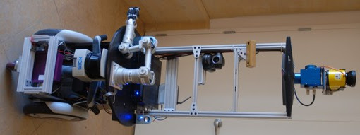

ROS
===

DEFINICIÓN
----------

El ROS o Robot Operating System (sistema operativo de robots), es una
colección de frameworks para el desarrollo de software de robots. Un
framework es un entorno de trabajo tecnológico que se basa en módulos
concretos que sirve de base para la organización y el desarrollo de
software.

|image0|

ROS no llega a ser considerado un sistema operativo como tal, ya que
necesita de un software de nivel superior para ser utilizado. Sin
embargo, ROS provee los servicios básicos de uno, como son la
abstracción del hardware, el control de dispositivos de bajo nivel, la
implementación de funcionalidad de uso común, el paso de mensajes entre
procesos y el mantenimiento de paquetes.

Está basado en una arquitectura de grafos, esto es, una estructura
formada por nodos, o extremos del sistema, y un conjunto de arcos que
establecen las relaciones entre dichos nodos. Estas relaciones se basan
en recibir, mandar y multiplexar mensajes de sensores, control,
periféricos, etc.

La librería está pensada y diseñada para ser utilizada en un sistema
operativo UNIX (base del actual Linux), sin embargo, también se están
lanzando versiones experimentales para otros sistemas operativos muy
comunes como Mac OS X, Debian o Microsoft Windows.

ROS se divide en dos partes básicas. Por un lado, actúa como nexo entre
el usuario y el hardware (más similar a un sistema operativo
convencional) y, por otra parte, se comporta como una batería de
paquetes desarrollados por una comunidad de usuarios. Estos paquetes
implementan numerosas funcionalidades como la localización y el mapeo
simultáneo, la planificación, la percepción, la simulación, etc.

HISTORIA
--------

ROS se desarrolló en 2007 bajo el nombre de switchyard por el
Laboratorio de Inteligencia Artificial de Stanford para dar soporte al
proyecto del Robot con Inteligencia Artificial de Stanford (STAIR) y al
programa de robots personales (PR), en los cuales se crearon prototipos
internos de sistemas de software destinados a la robótica.

|image1|

Desde 2008, el proyecto continuó principalmente en Willow Garage, un
instituto de investigación con más de veinte instituciones colaborando
en un modo de desarrollo federado, que proporcionó importantes recursos
para ampliar los conceptos ya creados y crear implementaciones sometidas
a varias pruebas.

El proyecto fue impulsado por una gran cantidad de investigadores con
mucha experiencia en el sector que aportaron numerosas ideas tanto al
núcleo central de ROS como al desarrollo de sus paquetes de software
fundamentales.

En un inicio, el software fue desarrollado utilizando la licencia de
código abierto BSD (Berkeley Software Distribution) y poco a poco se ha
convertido en una plataforma ampliamente utilizada en la comunidad de
investigación robótica.

Desde el principio, ROS ha sido desarrollado en múltiples instituciones
y para numerosos tipos de robots, incluidas aquellas que recibieron los
robots personales (PR2) directamente desde Willow Garage.

Cualquier persona puede iniciar su propio repositorio de código ROS en
sus propios servidores, y mantienen la plena propiedad y control del
mismo; además pueden poner su repositorio a disposición del público y
recibir el reconocimiento y el crédito que merecen por sus logros. De
esta forma también se fomenta la mejora del software ya existente con la
aportación de otros profesionales del sector.

Actualmente, el ecosistema de ROS cuenta con decenas de mies de usuarios
en todo el mundo, que trabajan en ámbitos que van desde proyectos
personales hasta grandes sistemas de automatización industrial.

Algunos de los robots que a día de hoy utilizan ROS son el robot
personal de Ken Salisbury en Stanford (PR1), el robot personal de Willow
Garage (PR2), el Baxter de Rethink Robotics, el Robot de Shadow en el
cual participan universidades españolas o el robot limpiador HERB de
Intel.

PROYECCIÓN FUTURA
-----------------

El sistema operativo de robots ya cuenta hoy en día con una estructura
muy completa que proporciona al usuario múltiples posibilidades. Algunas
de las funcionalidades que engloba este software a día de hoy son la
creación, destrucción y correcta distribución de nodos en la red, la
publicación o suscripción de flujos de datos, la multiplexación de la
información, la modificación de los parámetros del servidor y el testeo
de sistemas.

A pesar de la gran cantidad de servicios que ya ofrece, se espera que en
futuras versiones se incorporen algunas de las siguientes
funcionalidades a las aplicaciones de ROS: identificación y seguimiento
de objetos, reconocimiento facial y de gestos, la comprensión del
movimiento, el agarre y la egomoción, entre muchas otras.

Como se ha podido comprobar, esta tecnología ha avanzado enormemente
durante los últimos años, y se prevé que este auge se maximice en los
próximos años, desempeñando un papel fundamental en la revolución de la
industria 4.0 y el fenómeno conocido como “el internet de las cosas”.

.. |image0| image:: Pictures/1000000000000500000002D0AAEF59E49B5D52B7.jpg
   :width: 3.8071in
   :height: 2.122in

