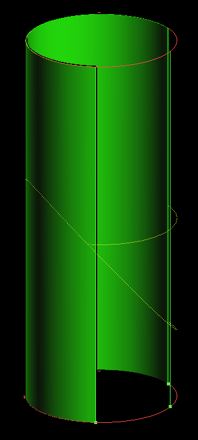
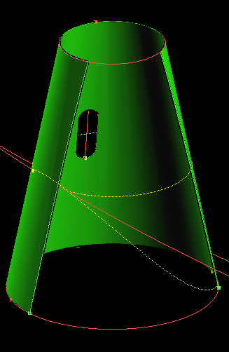
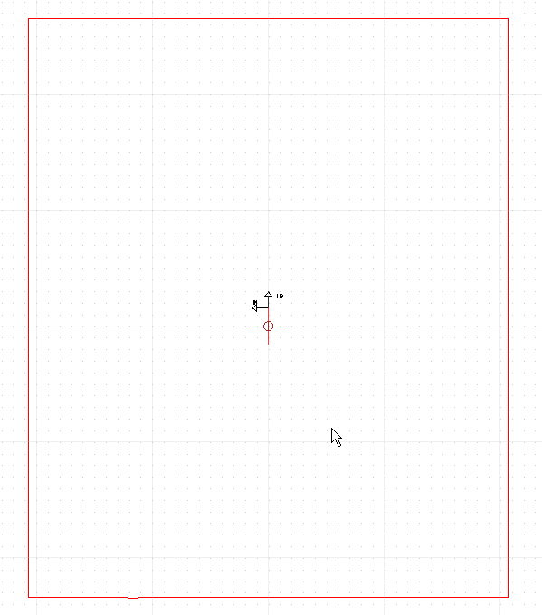
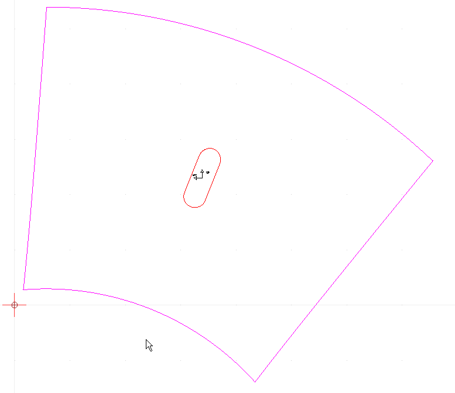
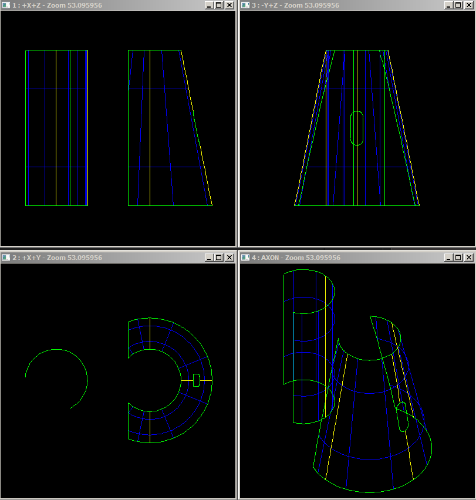

Unfolding cylinders and cones's documentation
=========================================================

This is a document describing the needed functionality for unfolding plates located on cylinders and cones **using analytical algorithms instead of numerical ones**.

The output geometry must be exact, for instance the development of a cone must be two straight line segment and one arc of circle. 

On the development geometry the unfolding geometry of ``TopoDS_Wire`` located total or partially inside the plate must be included.

Also is needed a method to convert from the 2D to the 3D geometry for wires.

Input
-----

The input will be a ``TopoDS_Face`` with holes and set of ``TopoDS_Wire`` located on the same surface. The wires can be total or partially located outside the plate (see images).

    
    plate on cylinder

    plate on cone

API
---

One example of the desired API will be the following:

.. code-block:: cpp

  TopoDS_Face the_face_to_unfold;

  AnaSurfUnfoldingTool unfolding_tool(the_face_to_unfold);
  unfolding_tool.Perform();

  if(unfolding_tool.Error() == Unfolding_OK)
  {
    TopoDS_Face the_unfolded_face = unfolding_tool.UnfoldFace();
  }

  TopoDS_Wire wire_3d;
  std::vector<TopoDS_Wire> unfolded_wires;

  bool unfold_ok = unfolding_tool.UnfoldWire(wire_3d, unfolded_wires);

  TopoDS_Wire wire_2d;
  bool convert_2dto3d_ok = unfolding_tool.From2DTo3D(wire_2d, wire_3d)

Output
------
The output will be the unfolded geometry of the faces and the part of the unfolded wires contained inside the face.

.. note:: On the attached images the marking wires are not included.

    
    unfolded plate on cylinder

    unfolded plate on cone

Data Samples
------------

Two brep files are included as data samples:

- ana_pl1.brep for the cylindrical plate
- ana_pl2.brep for the conical plate

    Data samples

