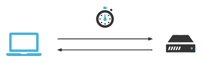

Diseño del análisis
===================

Preparación previa
------------------

Para realizar todas las mediciones de este trabajo, ha sido preciso
un estudio previo del entorno y una preparación para la utilización
del software a probar.

En primer lugar, es necesario conocer el funcionamiento de la placa.
Desde la propia página de Espressif es posible encontrar un documento
con todos los pasos detallados para iniciarse en la programación de la
placa. :cite:`ESP32_get_started`

Al principio se necesita instalar los requisítos de la aplicación en
función del sistema operativo en el que se opere. Después, hay que instalar
una serie de librerías proporcionadas por Espressif denominadas ESP-IDF.
Posteriormente se instalará una serie de herramientas y se configurarán las
variables de entorno. Una vez realizados estos pasos, ya será posible crear
un proyecto para la placa para comprobar que funciona correctamente.

Una vez comprobado el correcto funcionamiento de la placa, es necesario
instalar el software de micro-ROS y realizar una serie de pruebas. 
Es posible realizar primero una serie de prácticas primero con clientes
creados dentro del propio Linux. Para ello hay que instalar y compilar
el firmware adecuado, crear un agente de micro-ROS y ejecutar la aplicación.
Si todo funciona correctamente, será posible observar una serie de mensajes
publicados en el topic en cuestión. :cite:`first_micro_ros_linux_app`

Después de realizar unas primeras prácticas tanto con el software como con
el hardware que se quiere probar, es el momento de juntarlos y realizar
las primeras pruebas de micro-ROS en la placa esp32.

Para ello hay que seguir un tutorial similar al anterior en el que se explica
como realizar una primera aplicación de micro-ROS con conexión vía Wi-Fi. 
:cite:`connect_esp32_to_ros2`

Inicialmente hay que crear y configurar un nuevo firmware de trabajo.
En este momento hay que escoger el RTOS sobre el que se va a trabajar y
descargar sus herramientas y librerías propias. Posteriormente es necesario
configurar dicho firmware, especificando la aplciación que se quiere probar
y el tipo de conexión que se quiere establecer con la placa. Además, es necesario
operar sobre un menu de la propia placa en el que se pueden modificar numerosos
aspectos de la misma, como las variables de entorno o las especificaciones
de la conexión (p.e. SSID y contraseña Wi-Fi).

Una vez configurado, se compilará y se flasheará a la placa. En este momento
se envía la aplicación a la placa vía USB y esta se ejecuta. Sin embargo, es
necesario crear un agente en Linux para que la placa pueda conectarse a un
espacio de datos y publicar los mensajes. Tras realizar dicha acción, podrá
observarse cierta información en el agente creado, confirmando el establecimiento
de conexión entre el agente y el cliente. Este será el momento en el que podremos
comprobar que todo funciona correctamente. Mediante el comando "ros2 topic list"
se mostrará el topic creado y con "ros2 topic echo /[project name]" podremos
suscribirnos y observar los mensajes enviados por el cliente.

Despues de realizar unas pruebas con las demos que proporciona el sistema
operativo, es recomendable realizar una serie de tutoriales más avanzados
que proporciona la propia página de micro-ROS (https://micro.ros.org/docs/tutorials/programming_rcl_rclc/overview/).
En estos se enseña como diseñar tu propia aplicación, incluyendo como
crear tu propio nodo, tus publishers y subscribers, un temporizador o
incluso seleccionar la calidad de la comunicación.

Estructura principal del análisis
---------------------------------

Lo primero que hay que hacer en el momento de diseñar un test de comportamiento
de un software es definir los parámetros que se van a medir y en que condiciones.
Existen multitud de variables que se ven afectadas a la hora de realizar una
medición que aportan distintos tipos de información. Sin embargo, por distintas
razones, no es posible analizar todas ellas y es recomendable centrarse en un
número limitado de ellas para indagar más a fondo y obtener unas conclusiones
más concisas.

En este experimento se van a analizar la latencia global del sistema operativo
en tiempo real, el 'throughput' o tasa de transferencia efectiva y el consumo
de memoria del sistema.

A continuación se explicará detalladamente en que consisten estos parámetros
y de que manera pueden afectar a un sistema en tiempo real.

La latencia es el retraso entre los eventos generados por un hardware y la
transmisión efectiva de datos. En otras palabras, la latencia es el tiempo que
tarda en ejecutarse una tarea desde el momento en el que es ordenada.
Esto en un sistema en tiempo real es crucial, ya que es uno de los principales
culpables de que se cumplan o no los tiempos que deben de cumplir los sistemas.

https://en.wikipedia.org/wiki/Latency_(engineering)#:~:text=The%20latency%20is%20the%20delay,limitations%20which%20create%20additional%20latency.

    
    Latencia

Generalmente, un evento en un sistema de este estilo está formado por distintos
eventos más pequeños que dan lugar a la realización del evento principal. Por
este motivo, la latencia general del evento se descompone en varias latencias
más pequeñas que sumadas dan lugar a la latencia general del evento. En nuestro
caso, el evento comprende desde el momento en el que la aplicación ordena el envío
del mensaje hasta que este es publicado en el DDS, momento en el que este podrá
ser enviado a otros clientes que estén suscritos al topic.
Aquí se pueden encontrar distintas latencias. En primer lugar, el tiempo de respuesta
que emplea el microcontrolador en reaccionar al envío del mensaje. Seguidamente,
cabe recalcar el tiempo que tarda esta información en enviarse desde el cliente
al agente al que está conectado. Finalmente, es importante el tiempo que emplea
el agente en publicar los mensajes en el DDS.

Este último es el parámetro que se ha escogido para representar en un anális, ya
que el sistema operativo en el que se lanza el agente nos proporciona herramientas
que nos indican las latencias que ocurren en el sistema con alta precisión.

El throughput es el segundo parámetro que se va a medir en el test de comportamiento.
Esta variable muestra la capacidad de transmisión del sistema. Esta puede verse
limitada por distintos aspectos, tanto correspondientes al software tanto como
al hardware. En este ámbito, el factor más limitante va a residir en el microcontrolador,
ya que es una placa diseñada para operar con recursos muy limitados. En este
sentido resultará muy interesante comprobar el momento en el que se produzca la
saturación de la placa para determinar las limitaciones del sistema y para que aplicaciones
podría emplearse el microcontrolador.

    
    Throughput

Finalmente, se procederá a estudiar el consumo se memoria del sistema. En un principio,
micro-ROS es un software diseñado para microcontroladores, por lo que el efecto
de las acciones realizadas por este en el sistema global no deberían ser notables.
En este sentido, será interesante comprobar si realmente se trata de un sistema que
economiza los recursos y hasta que punto.

Los parámetros previamente mencionados aportarán información de gran interés de
cara a formalizar una idea general del rendimiento del software y del hardware
en valores absolutos. Sin embargo, al no conocerse un estudio semejante, resulta
difícil otorgarle un valor relativo a dichos resultados frente a otros sistemas.
Es por ello por lo que se han escogido varios escenarios para la realización de
pruebas. De este modo sera posible obtener unas conclusiones que expresen tanto
un sentido absoluto como relativo.

Se han diseñado cuatro escenarios para la obtención de datos. Como ya se ha comentado
previamente, la placa ESP32 cuenta con la peculiaridad de ofrecer conexión vía Wi-Fi,
algo poco habitual en placas de este estilo, además de una conexión en serie más
convencional. De otro modo, ya se ha explicado en el apartado de "software" que
micro-ROS cuenta con dos modos de comunicación para el envío de información.
Estos son el modo reliable, que requiere de una señal de confirmación por parte
del receptor, priorizando la fiabilidad de la comunicación; y el modo best-effort,
que trata de enviar la mayor cantidad de mensajes a la mayor velocidad, aunque en
redes poco robustas puede resultar poco fiable.

De este modo, combinando los dos tipos de conexión y los dos tipos de comunicación
se han formado cuatro situaciones que mostraran distintos resultados de los que
extraer conclusiones tras ser comparados.

Herramientas empleadas
----------------------

La herramienta principal de la que nos serviremos durante la totalidad de la
evaluación será una aplicación que se ha diseñado con el propósito exclusivo
de someter al sistema a distintas situaciones en las que, mediante otras
herramientas, recopilar datos.

La aplicación está programada en c e incluye las librerías de freeRTOS
que proporcionan las funciones propias de micro-ROS así como los tipos de mensajes
que se van a utilizar.

Esta aplicación será añadida al firmware, compilada y enviada a la placa, donde
se ejecutará periódicamente.

A continuación se muestra el código de la aplicación y posteriormente se procederá
a explicar los aspectos más reseñables del mismo.

.. code:: c

    #include <stdio.h>
    #include <unistd.h>

    #include <rcl/rcl.h>
    #include <rcl/error_handling.h>
    #include <std_msgs/msg/string.h>

    #include <rclc/rclc.h>
    #include <rclc/executor.h>

    #define ARRAY_LEN 1024

    #ifdef ESP_PLATFORM
    #include "freertos/FreeRTOS.h"
    #include "freertos/task.h"
    #endif

    #define RCCHECK(fn) { 
        rcl_ret_t temp_rc = fn;
        if((temp_rc != RCL_RET_OK)){
            printf("Failed status on line %d: %d. Aborting.\n",__LINE__,(int)temp_rc);
            vTaskDelete(NULL);
        }
    }
    #define RCSOFTCHECK(fn) {
        rcl_ret_t temp_rc = fn;
        if((temp_rc != RCL_RET_OK)){
            printf("Failed status on line %d: %d. Continuing.\n",__LINE__,(int)temp_rc);
        }
    }

    rcl_publisher_t publisher;
    std_msgs__msg__String msg;

    void timer_callback(rcl_timer_t * timer, int64_t last_call_time)
    {
        RCLC_UNUSED(last_call_time);
        if (timer != NULL) {
            RCSOFTCHECK(rcl_publish(&publisher, &msg, NULL));
        }
    }

    void appMain(void * arg)
    {
        rcl_allocator_t allocator = rcl_get_default_allocator();
        rclc_support_t support;

        // create init_options
        RCCHECK(rclc_support_init(&support, 0, NULL, &allocator));

        // create node
        rcl_node_t node;
        RCCHECK(rclc_node_init_default(&node, "my_test_app_publisher", "", &support));

        // create publisher
        RCCHECK(rclc_publisher_init_default(
            &publisher,
            &node,
            ROSIDL_GET_MSG_TYPE_SUPPORT(std_msgs, msg, String),
            "my_custom_publisher"));

        // create timer,
        rcl_timer_t timer;
        const unsigned int timer_period = 1;
        RCCHECK(rclc_timer_init_default(
            &timer,
            &support,
            RCL_MS_TO_NS(timer_period),
            timer_callback));

        // create executor
        rclc_executor_t executor;
        RCCHECK(rclc_executor_init(&executor, &support.context, 1, &allocator));
        RCCHECK(rclc_executor_add_timer(&executor, &timer));

        msg.data.data = (char *) malloc (ARRAY_LEN * sizeof(char));
        msg.data.size = 0;
        msg.data.capacity = ARRAY_LEN;

        memset(msg.data.data,'1',1024);
        msg.data.size = 1024;

        while(1){
            rclc_executor_spin_some(&executor, RCL_MS_TO_NS(1000));
        }

        // free resources
        RCCHECK(rcl_publisher_fini(&publisher, &node));
        RCCHECK(rcl_node_fini(&node));

        vTaskDelete(NULL);
    }
    
En primer lugar se añaden todas las librerías que se utilizarán y se definen
las funciones "RCCHECK" y "RCSOFTCHECK". Estás serán de gran utilidad durante
toda la ejecución, ya que se llamarán en el momento de utilizar cualquier otra
función para asegurar su correcto funcionamiento en el un tiempo establecido.
De no ser así se generarán distintos mensajes de error e incluso se forzará
la detención de la aplicación en función de la gravedad del fallo. Esto resulta
crucial en aplicaciones de este tipo, ya que un pequeño error en los tiempos
puede resultar muy significativo en sistemas de tiempo real.

Posteriormente se crea la función "timer_callback", que se ejecutará
cada vez que el timer llegue a cero. En ella simplemente se publica un mensaje
siempre que el timer siga contando.

Seguidamente se crean el nodo y el publisher. En la creación del publisher es en
la que se determina tanto la calidad de la comunicación como el tipo de mensaje
que este enviará. En este caso se utiliza la función "rclc_publisher_init_default",
lo que creará un publisher que actuará bajo el modo reliable. Para cambiar al
modo best-effort, sería necesario sustituir esta función por "rclc_publisher_init_best_effort",
manteniendo iguales los parámetros de la misma. Como se puede observar, el tipo
de mensaje escogido ha sido una cadena de caracteres o "string". Esto es debido
a la simplicidad que existe para modificar su tamaño y la facilidad de uso.

A continuación se crean el timer y el executor. Al timer se le asigna el periodo
en la variable "timer_period". Esta viene determinada en milisegundos, por lo que
en este caso el periodo sería de 1 milisegundo y la frecuencia de 1000 Hz. El
executor es el encargado de que cuando el temporizador baje a 0 se ejecute
la función "timer callback".

Consecutivamente se rellena la cadena de caracteres. Primero se reserva
el espacio en memoria que se pretende utilizar y después se rellenan
todos esos caracteres con la función memset. En este caso se han reservado
y rellenado 1024 caracteres, lo que equivale a 1 kilobyte.

Finalmente se lanza un bucle infinito en el que simplemente se llama a la función
"rclc_spin_some", que llamará al executor cada vez que el contador del timer finalice.
Se le ha asignado un "wake up time" de 1000 milisegundos para asegurarse que
siempre se ejecute a pesar de que pueda existir un pequeño delay en el sistema.

Esta aplicación será lanzada numerosas veces, asignando en cada ocasión los
parámetros que se quieran analizar. Cada vez que se modifique la aplicación
será necesario recompilar el firmware.

Una vez diseñada la aplicación es momento de configurar el firmware.

Para ello lo primero que hay que hacer es declarar el modo de conexión que
se quiere establecer. Este se realiza mediante los siguientes comandos.

.. code-block:: bash

    ros2 run micro_ros_setup configure_firmware.sh my_test_app -t serial

    ros2 run micro_ros_setup configure_firmware.sh my_test_app -t udp -i [IP] -p [port ID]

Mediante el primer comando se establecerá una conexión en serie. En el segundo
comando se configura una conexión vía Wi-Fi, en el que será necesario añadir
la ip de la conexión y el número de puerto que se pretende utilizar, normalmente
el 8888.

Si se ha seleccionado la conexión inalámbrica se empleará el siguiente comando
para añadir el SSID y la contraseña de nuestra red.

.. code-block:: bash

    ros2 run micro_ros_setup build_firmware.sh menuconfig
    
Finalmente se compilará el firmware completo y se enviará a la placa con los
dos siguientes comandos.

.. code-block:: bash

    ros2 run micro_ros_setup build_firmware.sh

    ros2 run micro_ros_setup flash_firmware.sh

En este momento será necesario lanzar el agente de micro-ROS desde
nuestra máquina. En función de si hemos optado por una conexión en serie
o inalámbrica emplearemos uno de los dos siguientes comandos:

.. code-block:: bash

    ros2 run micro_ros_agent micro_ros_agent serial --dev [device ID]

    ros2 run micro_ros_agent micro_ros_agent udp --port [port ID]

El devide ID es la identifiación de nuestro dispositivo, la cual
se podrá averiguar escribiendo "ls /dev/serial/by-id/*" en la línea de
comandos, y el port ID deberá ser el mismo que el seleccionado en
la configuración del hardware.

De este modo ya se ejecutará la aplicación y se enviarán los datos
al espacio DDS.

|

Para medir la latencia es imprescindible escoger y conoceruna herramienta
muy precisa. En este caso se va a utilizar cyclictest, una herramienta de
benchmarking para sistemas en tiempo real. En concreto, sirve para medir la
latencia del sistema.

https://wiki.linuxfoundation.org/realtime/documentation/howto/tools/cyclictest/start

Un análisis de la latencia puede ser muy distinto de otro dependiendo
de varios factores y las condiciones en las que se quiera realizar
el test. Es por ello por lo que es fundamental configurar bien la herramienta
antes de ser utilizada para obtener unos datos fiables.

En este caso se ha utilizado la siguiente configuración:

.. code-block:: bash

    cyclictest -D 1 --verbose -i 100 -p 95

El parámetro D indica la duración del test, en este caso de un segundo.
"Verbose" expresa que se produzca una salida detallada de la latencia.
La opción i muestra el tamaño del intervalo entre medidas, en este caso
de 100 micro segundos, por lo que se realizarán un total de 10000 medidas.
Finalmente, p indica la prioridad porcentual de los procesos que ocurran
en tiempo real, en este caso de máxima prioridad.

Estos resultados han sido volcados a un fichero para analizarlos posteriormente.

Se ha lanzado un análisis por cada escenario, estableciendo la frecuencia
en 1000 Hz y el tamaño del mensaje en 1 kilobyte. De este modo, la placa trabajará
bajo una gran demanda, sometiendola a una situación límitie. De esta forma
podremos observar la evolución de la latencia cuando la placa utiliza
todos sus recursos.

Para medir el throughput se ha utilizado el propio agente de micro-ROS.
Añadiendo la opcion -v5 después de ejecutar el agente, se muestra por pantalla
los mensajes publicados en el DDS. Se ha decidido volcar la salida por pantalla
en un fichero.

En este ámbito se han realizado 24 mediciones, 6 por cada escenario. En
ellas se ha modificado la frecuencia del envío de mensajes manteniendo
el tamaño del mismo.

La recopilación de cada análisis, ha sido de unos 15 segundos, tiempo
más que suficiente para generar una muestra amplia del número de mensajes
que se ha llegado a publicar en ese tiempo en concreto. En la salida
del agente también se muestra el tiempo exacto de la publicación de los
mensajes por lo que simplemente ha sido necesario realizar una media
del número de mensajes publicados por segundo y multiplicarlos por
el tamaño del mensaje.

Por último, la medición de la memoria empleada se ha producido utilizando
el comando "htop" de Ubuntu, en el que se muestra el consumo de la memoria
de cada tarea llevada acabo en cada momento.

Finalmente cabe destacar que se ha utilizado Jupyter Notebook para
realizar las gráficas y los análisis estadísticos.

    
    Logotipo de Jupyter notebook