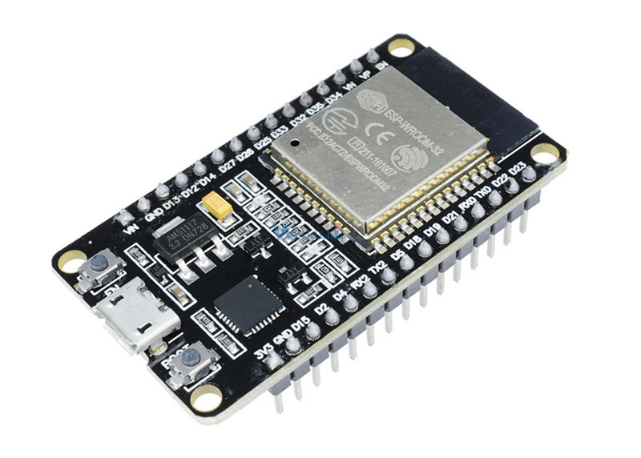

Hardware
========

Micro-ROS tiene como objetivo llevar ROS 2 a un amplio conjunto
de microcontroladores para conseguir tener entidades de ROS 2 de
primera clase en el mundo embebido. Los principales objetivos de
micro-ROS son las familias de microcontroladores de gama media de 32 bits.
Normalmente, los requisitos mínimos para ejecutar micro-ROS en una
plataforma embebida son las restricciones de memoria. En general, micro-ROS
necesitará microcontroladores que contengan decenas de kilobytes de memoria
RAM y periféricos de comunicación que permitan la comunicación entre el
cliente y el agente de micro-ROS.

El soporte de hardware de micro-ROS se divide en dos categorías,
las placas con soporte oficial y las placas soportadas por la comunidad.
Dentro de la gran cantidad de gamas de placas que poseen soporte directo
de micro-ROS, encontramos dispositivos de proveedores con cierto renombre
como Renesas, Espressif, Arduino, Raspberry, ROBOTICS, Teensy, ST, Olimex,
etc. :cite:`micro_ros_hardhare`

ESP-32
------

La placa que se ha utilizado para la medición de los tiempos de
respuesta ha sido la “Espressif ESP32”. Esta posee numerosas cualidades
positivas que se explicarán a continuación. Sin embargo, las razones
principales de esta elección han sido su bajo consumo, la posibilidad
de conexión vía WIFI y la activa comunidad y soporte que ofrece micro-ROS
a Espressif.

Espressif es una empresa pionera en el mundo del internet de las
cosas (IoT). Son un equipo de especialistas en creación de chips y desarrollo
de software. Una particularidad de esta empresa es el apoyo que proporcionan
a sus clientes para construir sus propias soluciones y conectar con otros
socios del mundo IoT. Los productos de Espressif se han implementado
principalmente en el mercado de placas, cajas OTT
(servicios de libre transmisión), cámaras e IoT. :cite:`expressif_systems`

    
    Placa ESP32

El modelo concreto que se ha utilizado es la “ESP32-DevKitC V4”.
Forma parte de las placas de desarrollo o “DevKits”, dispositivos de
reducido tamaño y accesibles para programadores inexpertos diseñadas para
facilitar el prototipado. Estas están alimentadas por un módulo que les
suministra la mayoría de funcionalidades. La disposición de los pines de
entrada/salida están repartidos en ambos lados para facilitar la interconexión.
Los desarrolladores pueden conectar los periféricos con cables puente
o montar la DevkitC en una protoboard. Una de las particularidades que
más destacan de estos modelos son la posibilidad de conexión vía Wi-Fi
y Bluetooth. Esto permite realizar prototipos inalámbricos que simulan
un entorno con muchas posibilidades que se asemeja más a la idea original
del IoT. :cite:`ESP32-DevKitC`

La DevKitc V4 que se ha utilizado cuenta con los siguientes componentes:

-   Un módulo ESP32-WROOM-32D

-   Botón de reseteo “EN”

-   Botón de descarga “Boot”: Presionando el botón “Boot” y después
    pulsando el botón “EN”, inicia la descarga del firmware a través
    del puerto en serie.

-   Puente de USB a UART: Permite la transferencia de datos desde un
    puerto de tipo USB a un puerto UART.

-   Puerto Micro USB: Sirve tanto como fuente de alimentación como de
    interfaz de comunicación entre el ordenador y el módulo ESP32-WROOM-32D.

-   Led de encendido de 5V: Se enciende cuando el USB u otra fuente de
    alimentación está conectada a la placa.

-   Entradas/salidas: La mayoría de los pines del módulo están repartidos
    en los cabezales de los pines de la placa. A través de ellos se pueden
    programar múltiples funciones como PWM, ADC, DAC, I2C, I2S, SPI, etc.

.. figure:: Fotos/esp32-devkitc-functional-overview.jpg
    :width: 500px
    :align: center
    
    Componentes de la placa ESP32 (Fuente: Espressif)

El ESP32-WROOM-32D es un módulo de microcontrolador genérico que se dirigen
a una amplia gama variedad de aplicaciones, que van desde redes de sensores
de baja potencia hasta otras tareas de mayor exigencia, como codificación
de voz, transmisión de música y decodificación de MP3. 

El núcleo de este módulo es el chip ESP32-D0WD. El chip está diseñado para
ser escalable y adaptable. Existen dos núcleos de CPU que pueden ser
controlados individualmente y la frecuencia de reloj es ajustable de 80 MHz
a 240 MHz. El chip cuenta con un coprocesador de bajo consumo que
puede utilizarse en lugar de la CPU para ahorrar energía en tareas
que no requieren mucha potencia de cálculo, como la monitorización de
periféricos. ESP32 cuenta con un amplio conjunto de periféricos integrables,
que van desde sensores táctiles capacitivos, sensores Hall, interfaz
de tarjeta SD, Ethernet, SPI de alta velocidad, UART, I2S e I2C.

La integración de Bluetooth y Wi-Fi garantiza que se pueda abordar
una amplia gama de aplicaciones y una gran polivalencia del módulo.
El uso de Wi-Fi permite un gran alcance físico y la conexión directa
a Internet a través de un router, mientras que el uso de Bluetooth
permite al usuario conectarse cómodamente al teléfono o emitir balizas
de baja energía para su detección.

La corriente de reposo del chip ESP32 es inferior a 5 uA, hecho que lo
convierte adecuado para aplicaciones alimentadas por batería y de electrónica
portátil. El módulo admite una velocidad de datos de hasta 150 Mbps y
una potencia de salida de 20 dBm en la antena para garantizar el mayor
alcance físico posible.

El sistema operativo elegido para ESP32 es freeRTOS con LwIP,
aunque también se ha incorporado TLS 1.2 con aceleración por hardware. :cite:`ESP32_WROOM_32_Datasheet`

    
    Módulo ESP32-WROOM-32D

Computador
----------

Todo el trabajo se ha realizado haciendo uso de un ordenador personal,
de unos 4 años de uso que se encuentra en perfecto estado.
Este es un Asus UX340. 
Este ordenador portátil cuenta con 16 GB de memoria RAM, 256 GB de
almacenamiento SSD, arquitectura de 64 bits y un microprocesador Intel i5.

    
    Asus UX430U

Se ha utilizado el sistema operativo Linux, en la distribución Ubuntu 20.04.3 LTS.

Cable micro-USB
---------------

En el transcurso del proyecto se han utilizado dos cables. En
primer lugar se utilizó un cable estándar, sin embargo, no permitía
entregar toda la potencia requerida por la placa. Seguidamente se
sustituyó por un cable de calidad superior.

    
    Cable micro-USB

Router TP-Link
--------------

Para obtener unas medidas que no se vean alteradas por el tráfico
que pueda existir en la red doméstica, se ha adquirido un router
adicional. Este es un Archer 80 de la marca TP-Link.
Cuenta con 1300 Mbps en la banda de 5 GHz y 600 Mbps en la banda
de 2.4 GHz. Tiene una tecnología MIMO 3x3 con cobertura de Wi-Fi
potenciada. Este se conectará por cable a una red doméstica de 1Gbps
de descarga.

    Router TP-Link