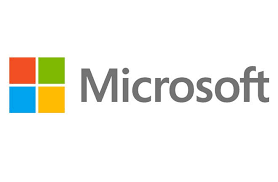
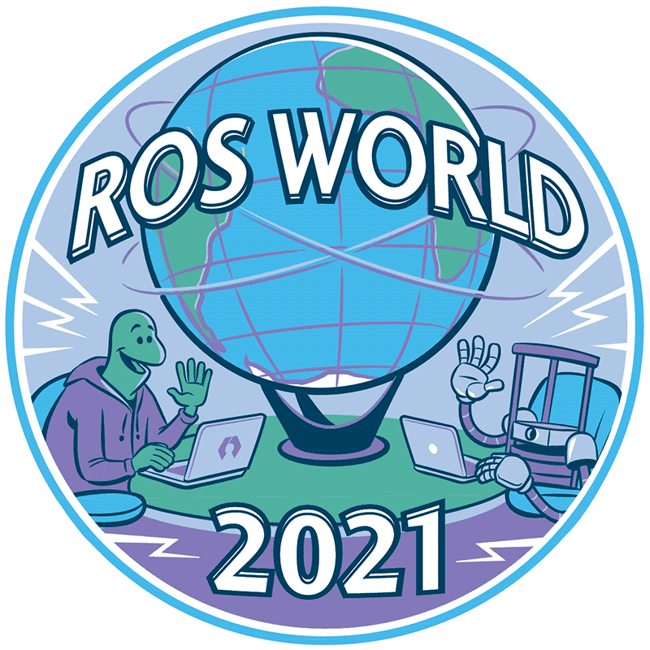

Marco teórico y estado del arte
===============================

Sistemas en tiempo real
-----------------------

Se dice que un sistema opera en tiempo real cuando el tiempo que tarda
en efectuarse la salida es significativo. El tiempo de respuesta puede
ser relativamente flexible (tiempo real suave) o más estricto (tiempo
real duro), lo que se denomina software crítico. :cite:`tiempo_real`

La falta de respuesta en el tiempo establecido puede ocasionar graves
consecuencias para el entorno del sistema, llegando a producir daños a
la vida y a la propiedad.

Es por ello por lo que un sistema en tiempo real se diseña
específicamente para la tarea que ha de acometer, utilizando un hardware
y software dedicados.

El software empleado en sistemas de tiempo real cuenta con una serie de
características propias que garantizan el correcto funcionamiento del
sistema:

-  Sistema operativo en tiempo real: Los sistemas operativos en general
   tienen dos principales funciones, gestionar bien los recursos que
   proporciona el hardware y facilitar el uso del mismo al usuario. En
   este caso, los objetivos del sistema operativo en tiempo real son los
   mismos pero enfocados a las restricciones de tiempo y ocupar un
   tamaño reducido para que pueda aplicarse a sistemas embebidos.

-  Lenguaje de programación en tiempo real: Proporciona esquemas básicos
   como la comunicación y la sincronización entre tareas, el manejo de
   errores y la programación de funciones a realizar en tiempo real. El
   lenguaje C se ha utilizado ampliamente para este tipo de tareas
   debido a su facilidad de uso e interacción con el hardware. Sin
   embargo, otros lenguajes como Ada o Java se han desarrollado
   específicamente para este tipo de uso y cada vez tienen más peso en
   el sector.

-  Una red en tiempo real: Un sistema en tiempo real necesita una red
   que sea puntual y fiable en la transferencia de mensajes, para ello
   cuentan con un protocolo específico para trabajar en tiempo real que
   proporciona una entrega puntual y garantizada de los mensajes a
   través de la red.

Las características principales de los sistemas en tiempo real son las
siguientes:

-  Cumplimiento en los plazos de ejecución: Es lo que distingue a este
   tipo de sistemas respecto al resto de sistemas informáticos.

-  Previsibilidad: Han de ser capaces de prever cualquier tipo de orden
   que pueda ocurrir posteriormente para estar preparado y que no haya
   fallos en los tiempos de ejecución.

-  Seguridad y fiabilidad: Muchos sistemas de este tipo se encargan de
   controlar otros sistemas peligrosos en los que es de vital
   importancia la precisión, ya no solo en el tiempo de la ejecución
   sino en los movimientos del sistema.

-  Tolerancia a los fallos: Debido a la importancia del correcto
   funcionamiento de estos sistemas, deben estar diseñados para que un
   fallo en el propio hardware o software del mismo no repercuta
   drásticamente en el resto de componentes y operaciones que ejecute el
   sistema.

-  Concurrencia: El sistema tiene que ser capaz de cooperar con otros
   sistemas que estén operando en el mismo entorno y, en determinadas
   ocasiones, incluso utilizar el hardware o software de dichos
   sistemas. :cite:`2019:erciyes`

Sistemas embebidos
++++++++++++++++++

La mayoría de sistemas utilizados en tiempo real son sistemas embebidos.
Estos son aquellos en los que el computador se encuentra integrado en el
sistema. Se caracterizan por no ser sistemas informáticos generales que
se programan para distintas tareas, sino que están diseñados para
cumplir un objetivo en concreto. Generalmente, un sistema embebido está
constituido por un microcontrolador y una infraestructura diseñada para
el propósito para el que está diseñado. El microcontrolador está
constituido por una unidad central (CPU), que se encarga de realizar la
mayoría de procesos, una memoria, que almacena las instrucciones y otro
tipo de datos que aseguran el correcto funcionamiento del sistema; y un
subsistema de entrada y salida, que suele contar con temporizadores,
convertidores de señales analógicas y digitales, y canales de
comunicación en serie.

Sistemas en tiempo real distribuido
+++++++++++++++++++++++++++++++++++

Un sistema que trabaja en tiempo real distribuido está formado por unos
nodos autónomos que se comunican entre sí a través de una red que
trabaja en tiempo real y que cooperan para lograr unos objetivos comunes
en unos plazos determinados.

Estos sistemas son fundamentales debido a varias razones. En primer
lugar, la computación en tiempo real es esencialmente distribuida, ya
que se basa en la transferencia de información entre dos extremos
(nodos) a realizar en un tiempo determinado.

Seguidamente, la comunicación en tiempo real distribuido permite aislar
las partes del sistema e identificar fallos en el mismo evaluando los
nodos de la operación por separado. El cálculo realizado en cada nodo
debe cumplir con las restricciones de tiempo de las tareas, y la red
debe proporcionar un procesamiento en tiempo real con retrasos limitados
en los mensajes.

Además de esto, un equilibrio entre los distintos nodos del sistema
mejora el rendimiento del mismo.

Existen varios tipos de sistemas en tiempo real distribuido, sin
embargo, la arquitectura general de todos ellos es similar a la
figura que aparece a continuación.

.. figure:: Fotos/distributed_real-time_system_structure.png
    :width: 450px
    :align: center
    
    Arquitectura general de un sistema en tiempo real distribuido (Fuente: Distributed Real-Time Systems, 2019)

En la figura se observa cómo todos los nodos están conectados
entre sí a través de la red de tiempo real, y a su vez, cada uno está en
contacto con distintas funciones propias que interactúan directamente
con el sistema.

ROS
---

Definición
++++++++++

El ROS o Robot Operating System (sistema operativo de robots), es una
colección de *frameworks* para el desarrollo de software de robots. Un
*framework* es un entorno de trabajo tecnológico que se basa en módulos
concretos que sirve de base para la organización y el desarrollo de
software. :cite:`robot_operating_system`

.. figure:: Fotos/ROS.jpg
    :width: 300px
    :align: center
    
    Logotipo de ROS

ROS no llega a ser considerado un sistema operativo como tal, ya que
necesita de un software de nivel superior para ser utilizado. Sin
embargo, ROS provee los servicios básicos de uno, como son la
abstracción del hardware, el control de dispositivos de bajo nivel, la
implementación de funcionalidad de uso común, el paso de mensajes entre
procesos y el mantenimiento de paquetes. :cite:`que-es-ros`

Está basado en una arquitectura de grafos, esto es, una estructura
formada por nodos, o extremos del sistema, y un conjunto de arcos que
establecen las relaciones entre dichos nodos. Estas relaciones se basan
en recibir, mandar y multiplexar mensajes de sensores, control,
periféricos, etc.

La librería está pensada y diseñada para ser utilizada en un sistema
operativo UNIX (base del actual Linux), sin embargo, también se están
lanzando versiones experimentales para otros sistemas operativos muy
comunes como Mac OS X o Microsoft Windows.

ROS se divide en dos partes básicas. Por un lado, actúa como nexo entre
el usuario y el hardware (más similar a un sistema operativo
convencional) y, por otra parte, se comporta como una batería de
paquetes desarrollados por una comunidad de usuarios. Estos paquetes
implementan numerosas funcionalidades como la localización y el mapeo
simultáneo, la planificación, la percepción, la simulación, etc.

Historia
++++++++

ROS se desarrolló en 2007 bajo el nombre de switchyard por el
Laboratorio de Inteligencia Artificial de Stanford para dar soporte al
proyecto del Robot con Inteligencia Artificial de Stanford (STAIR) y al
programa de robots personales (PR), en los cuales se crearon prototipos
internos de sistemas de software destinados a la robótica. :cite:`ros_history`

.. figure:: Fotos/STAIR.png
    :width: 150px
    :align: center
    
    Robot con Inteligencia Artificial de Stanford (Fuente: Stanford University)

Desde 2008, el proyecto continuó principalmente en Willow Garage, un
instituto de investigación con más de veinte instituciones colaborando
en un modo de desarrollo federado, que proporcionó importantes recursos
para ampliar los conceptos ya creados y crear implementaciones sometidas
a varias pruebas.

El proyecto fue impulsado por una gran cantidad de investigadores con
mucha experiencia en el sector que aportaron numerosas ideas tanto al
núcleo central de ROS como al desarrollo de sus paquetes de software
fundamentales.

En un inicio, el software fue desarrollado utilizando la licencia de
código abierto BSD (Berkeley Software Distribution) y poco a poco se ha
convertido en una plataforma ampliamente utilizada en la comunidad de
investigación robótica.

Desde el principio, ROS ha sido desarrollado en múltiples instituciones
y para numerosos tipos de robots, incluidas aquellas que recibieron los
robots personales (PR2) directamente desde Willow Garage.

Cualquier persona puede iniciar su propio repositorio de código ROS en
sus propios servidores, y mantienen la plena propiedad y control del
mismo; además pueden poner su repositorio a disposición del público y
recibir el reconocimiento y el crédito que merecen por sus logros. De
esta forma también se fomenta la mejora del software ya existente con la
aportación de otros profesionales del sector.

Actualmente, el ecosistema de ROS cuenta con decenas de miles de usuarios
en todo el mundo, que trabajan en ámbitos que van desde proyectos
personales hasta grandes sistemas de automatización industrial.

Algunos de los robots que a día de hoy utilizan ROS son el robot
personal de Ken Salisbury en Stanford (PR1), el robot personal de Willow
Garage (PR2), el Baxter de Rethink Robotics, el Robot de Shadow, en el
cual participan universidades españolas, o el robot limpiador HERB de
Intel.

Proyección futura
+++++++++++++++++

ROS ya cuenta hoy en día con una estructura
muy completa que proporciona al usuario múltiples posibilidades. Algunas
de las funcionalidades que engloba este software a día de hoy son la
creación, destrucción y correcta distribución de nodos en la red, la
publicación o suscripción de flujos de datos, la multiplexación de la
información, la modificación de los parámetros del servidor y el testeo
de sistemas.

A pesar de la gran cantidad de servicios que ya ofrece, se espera que en
futuras versiones se incorporen algunas de las siguientes
funcionalidades a las aplicaciones de ROS: identificación y seguimiento
de objetos, reconocimiento facial y de gestos, la comprensión del
movimiento, el agarre y la egomoción, entre muchas otras.

Como se ha podido comprobar, esta tecnología ha avanzado enormemente
durante los últimos años, y se prevé que este auge se maximice en el futuro próximo,
desempeñando un papel fundamental en la revolución de la
industria 4.0 y el fenómeno conocido como “el internet de las cosas”.
:cite:`ros_rolling`

.. bibliography::
   :style: plain

Micro-ROS
---------

Definición
++++++++++

Micro-ROS es un *framework* que acerca las aplicaciones robóticas
diseñadas para infraestructuras de gran tamaño a dispositivos con
recursos limitados como son los microcontroladores. Este software lleva
la interfaz de programación de ROS a estos dispositivos y permite
integrarlos en los sistemas basados en ROS 2. La combinación entre ROS 2
y micro-ROS da como resultado un marco robótico que reduce las barreras
de entrada al mercado, reduciendo costes y acelerando el desarrollo de
robots.

.. figure:: Fotos/micro_ros.jpeg
    :width: 200px
    :align: center
    
    Logotipo de micro-ROS

La contribución de micro-ROS al mundo de la robótica va más allá. El
poder adaptar el sistema operativo de robots a sistemas embebidos
permite la interoperabilidad que exigen los sistemas robóticos
distribuidos para explotar la creciente superposición entre la robótica,
los dispositivos integrados y el IoT. De este modo, se simplifica la
construcción y el diseño de aplicaciones para sistemas robóticos de gran
tamaño, pudiendo dividirse estos en sistemas aislados más pequeños y
sencillos capaces de conectarse entre si, dotando al sistema general de
más información acerca del entorno, permitiendo que los sistemas
robóticos verdaderamente distribuidos interactúen de forma aún más
inteligente con el mundo que les rodea. :cite:`micro_ros_video`

Historia
++++++++

Micro-ROS surgió a finales del año 2018, durante la celebración de
la "ROSCon", el evento más importante para la comunidad de ROS. Durante la conferencia
se habló sobre los beneficios que podría suponer la integración de ROS2 en los
microcontroladores. :cite:`ROSCon2018`

Durante 2019, micro-ROS comenzó a utilizarse en los primeros RTOS. El primero
en incorporarlo en sus librerías fue NuttX, el cual desarrolló una serie de
aplicaciones de prueba en mayo de ese mismo año. :cite:`NuttX_demos`

En 2020, micro-ROS continuó creciendo y realizando proyectos en común con
otros RTOS como FreeRTOS o Zephyr. Sin embargo, el mayor avance realizado
en ese año fue el desarrollo de nuevas versiones de Micro XRCE-DDS, el agente de
micro-ROS encargado de conectar el mundo de los microcontroladores con el espacio
de datos de ROS. :cite:`XRCE_DDS_120_release`

Ese mismo año se incluyó micro-ROS en la IDE de Arduino, un avance muy notable
ya que se trata de uno de los entornos de desarrollo más utilizados en lo que
a microcontroladores se refiere. :cite:`micro-ROS_arduino`

Durante este año se ha hecho realidad la noticia que afirma que micro-ROS se integrará
en el sistema operativo de Microsoft, el Microsoft Azure RTOS. El hecho de que micro-ROS
se haya incorporado en un software soportado por Microsoft le otorga una estabilidad
y un renombre que impulsará todavía más el desarrollo de esta tecnología. :cite:`MicrosoftAzureRTOS`

    
    Logotipo de microsoft

Proyección futura
+++++++++++++++++

Recientemente ha tenido lugar la conferencia de "ROS World 2021". En ella se han mostrado
los nuevos avances que tendrán lugar en el futuro cercano del universo de ROS. :cite:`ROSWorld2021`

    
    Logotipo de ROS World 2021

En lo referido a micro-ROS, se ha anunciado una nueva librería del cliente y nuevas
funciones del middleware. En particular, se ha revelado el uso de la interfaz de Micro XRCE-DDS
para transportes personalizados, el paquete de diagnósticos de micro-ROS y el concepto de
trabajador para la gestión de la ejecución en la librería del cliente en C, rclc.

Además, se ha confirmado la posibilidad del desarrollo de aplicaciones profesionales
utilizando IDEs basados en Eclipse.

Estas noticias son muestras de que micro-ROS tiene un futuro muy prometedor por delante,
apoyado por una comunidad y un entorno muy favorables. La clave de esta previsión de
futuro es el esfuerzo que está realizando el mundo de ROS por acercar esta tecnología
a programadores inexpertos para ampliar en gran medida el alcance de la robótica.