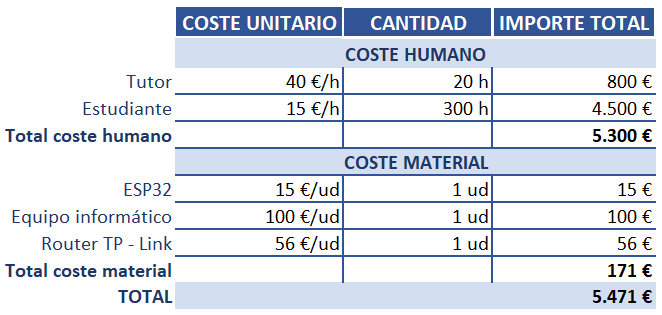

Planificación temporal y presupuesto
====================================

Planificación temporal
----------------------

A continuación se muestra el diagrama de Gantt de las actividades
llevadas a cabo durante la realización del trabajo. Las fechas
tienen una fecha y duración aproximada.

    
    Diagrama de Gantt

Aunque no es apreciable en el diagrama, la carga de trabajo ha sido
muy variable durante toda la duración del ejercicio, siendo muy
superior durante los meses de septiembre y octubre frente a
julio y agosto.

Presupuesto
-----------

En la siguiente tabla se muestra una estimación del coste total
que ha supuesto el trabajo. En el se ha estimado que cada hora
empleada por el tutor se valora en 40 euros y cada hora empleada
por el alumno tiene un valor de 15 euros. Además se ha incluido
un coste de los equipos informáticos utilizados, puesto que aunque
ya se tuvieran antes del comienzo del trabajo, durante el mismo se
ha producido un desgaste debido a la gran cantidad de horas que
se han utilizado.

    
    Presupuesto

En este sentido el valor total que se le asigna a la realizacion
del trabajo es de 5471 euros. Esta cifra es un valor aproximado
pero que muestra una buena representación de lo que podría
equivaler en relación con una investigación profesional.