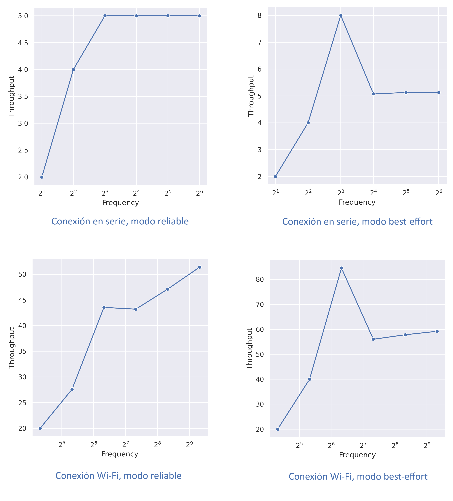

Resultados
==========

A continuación se muestran los resultados de los análisis y una
discusión de estos, además de las conclusiones obtenidas teniendo
en cuenta diferentes factores.

Latencia
--------

A continuación se muestran las gráficas de los datos expresadas como densidades de
latencias y un histograma con los datos discretos de todas las latencias.

Observando los resultados durante la recopilación de datos, ha resultado llamativo el hecho de que más del
90% de las latencias obtenidas se comprenden entre los 3 y los 4
microsegundos. Sin embargo, es un resultado esperado, ya que la frecuencia
con la que se deberían enviar los mensajes es de 1000 Hz (periodo de 1 milisegundo),
y el intervalo de medida de la latencia es de 100 microsegundos (10 veces menor),
por lo que cabe esperar que 9 de cada 10 veces, las latencias producidas sean
de eventos que realiza el sistema simplemente por permanecer encendido.

Esto se ha diseñado de esta manera a propósito, puesto que tras realizar
ensayos previos se ha detectado que las latencias producidas en el sistema oscilaban
entre los 5 y los 50 microsegundos, por lo que con un periodo inferior cabía
la posibilidad de que el delay en el sistema fuera superior al intervalo y la medición
de esta finalizase antes que el propio retraso. Por otra parte, si se aumentaba
en gran medida el intervalo, se corría el riesgo de no registrar las latencias
producidas por algunos eventos.

Es por ello por lo que se ha decidido suprimir en las gráficas las mediciones
de 3 microsegundos, ya que no son relevantes a la hora de analizar el sistema
e impiden observar con claridad el comportamiento de este.

Distribución
++++++++++++

.. figure:: Fotos/latency_dist.png
    :width: 650px
    :align: center
    
    Distribución de latencias

Comparando las cuatro gráficas de las distribuciones de las latencias,
lo primero que resalta a simple vista es el hecho de las gráficas
del mismo modo de conexión tienen una morfología bastante similar.

Las distribuciones de densidades obtenidas mediante la conexión en
serie siguen una curva especialmente regular, con un máximo en una latencia
ligeramente inferior a 5 microsegundos, desde donde la función desciende con una pendiente
prácticamente constante hasta los 7 microsegundos, donde comienza una curva
considerable que produce que la densidad se haga aproximadamente nula a los
10 microsegundos.

Por el contrario, las gráficas resultantes de la conexión Wi-Fi contienen
una forma peculiarmente irregular. Es cierto que en ambas se sigue alcanzando
el máximo global en una latencia muy similar a las gráficas anteriores. Sin embargo,
se puede observar como la pendiente descendente del análisis realizado con conexión
Wi-Fi y en modo reliable está dividida en dos tramos, una primera pendiente muy moderada
hasta los 5 microsegundos seguida de una mucho más brusca que desciende la función desde el
35% hasta el 7% de la densidad de la latencia. De la misma manera, el modo best-effort también
presenta un patrón poco reconocible, debido al cambio de tendencia que existe en la función
después de una fuerte bajada. Este punto de inflexión ocurre en torno a los 6 microsegundos y
genera un mínimo relativo para que la curva experimente un ligero remonte hasta los 
7.5 microsegundos.

Estas diferencias en las morfologías de las gráficas pueden explicarse entendiendo
que la conexión en serie da lugar a una transmisión de datos más regular que
la conexión inalámbrica.

Por otro lado, también resulta llamativo otro aspecto relacionado con la calidad
del servicio escogida. Las gráficas obtenidas de los experimentos en modo
reliable tienen el 40% de las latencias obtenidas entre los 4 y 5 microsegundos.

Sin embargo, la distribución de las latencias resultantes de las pruebas realizadas
en modo best-effort es mucho más homogénea, teniendo estas su máximo en torno al
27% y el 32%. Además, la anchura del pico de las bajas latencias es notablemente
superior, finalizando este prácticamente en los 10 microsegundos, frente a los
7 microsegundos que presentan las gráficas de modo reliable.

Estos resultados son muy comprensibles. El modo best-effort permite una comunicación
más fluida, lo que se traduce que bajo la gran demanda que estaba trabajando la placa,
se envíen más mensajes en el mismo tiempo que en el modo reliable. Al llegar más datos
en la misma cantidad de tiempo, el agente tiene una mayor carga de trabajo y realiza
más operaciones, ya que tiene que publicar más mensajes en el DDS.

Histograma
++++++++++

.. figure:: Fotos/latency_hist.png
    :width: 650px
    :align: center
    
    Histogramas de latencias

El histograma de latencias muestra una información similar a la distribución previamente estudiada.

Sin embargo, cabe destacar que en estos diagramas se puede apreciar más fácilmente
como la gráfica correspondiente a la conexión en serie con modo reliable presenta
el patrón más reconocible, al tratarse de una comunicación más estable y menos saturada;
y como la gráfica correspondiente a la conexión vía Wi-Fi y en modo best-effort forma
una secuencia mucho más irregular, resultado de una conexión más inestable y de
mayor volumen.

Tras analizar estos resultados se llega a la conclusión de que, como era de esperar, 
la manera en la que se comunican el cliente y el agente repercute notablemente en la
manera en la que responde el sistema en cierto real.

Es cierto que, a pesar de que un pequeño retraso en el cumplimiento de
una tarea asignada puede ser crítico en el desempeño general del sistema, los retrasos
producidos entre la orden y el cumplimiento del evento en este sistema son prácticamente
despreciables en cualquiera de los cuatro escenarios formados, ya que en su mayoría
no sobrepasan los 15 microsegundos. 

Esto es causado principalmente porque el sistema está compuesto por dos componentes con
una diferencia abismal de capacidad de procesamiento. Por un lado, la placa ESP32 está
es un dispositivo que cuenta con unos recursos extremadamente limitados, cuyo objetivo
no es trabajar con un volumen elevado de datos que puedan suponer un problema en el
rendimiento del sistema, sino establecer una conexión rápida y fiable con un agente
para realizar pequeñas operaciones a una alta velocidad. Por otro lado, se está
utilizando como agente un ordenador de última generación que cuenta con un procesador intel
de cuatro núcleos, al que una transferencia de datos que en el caso más optimista
rondaría el megabyte por segundo no debería afectar en gran medida a su rendimiento.

Conclusión
++++++++++

Estas conclusiones muestran las posibilidades que ofrecen este tipo de sistemas en la vida
real. Por una parte, sería muy posible reducir en gran medida la calidad del dispositivo en
la mayoría de aplicaciones, obteniendo igualmente unos resultados sobresalientes. Por
otro lado, también resultaría muy interesante un sistema similar en el que un solo agente
pudiera controlar una gran cantidad de clientes sin verse afectado el rendimiento.

En cualquiera de los escenarios propuestos, los resultados que se han obtenido
en las mediciones de la latencia son fácilmente extrapolables y proporcionan una idea
de las ventajas y limitaciones que tendrían en función de la configuración del
mismo.

Throughput
----------

    
    Evolución del throughput

La capacidad de transferencia es un dato muy relevante en estos sistemas,
ya que suponen un indicativo de peso para delimitar las aplicaciones que pueden
llevarse a cabo.

En primer lugar se puede observar como todas las gráficas obtenidas tienden hacia
un valor de throughput. Este valor indica la capacidad de transferencia de datos
de nuestro sistema cuando este se satura, es decir, la teórica máxima tasa de
transferencia.

Sin embargo, como se verá a continuación, esto no siempre es así y existen
excepciones.

Para estimar los valores en los que podía darse el punto de saturación, 
se ha utilizado un método de prueba y error en los que se ha repetido el experimento
numerosas veces hasta establecer un intervalo en el que la tasa de transferencia no
aumentaba. De este modo se han establecido unos valores, distintos en cada caso,
para los que tomar datos y observar con precisión el momento de saturación.

A continuación se va a realizar un análisis detallado de las gráficas obtenidas.

Como ya ocurrió en el análisis de la latencia, un primer aspecto que llama la
atención es la diferencia de morfología que se observa entre las gráficas de las
pruebas realizadas bajo el modo reliable y las realizadas con el modo best-effort.

Primeramente, se puede ver como en las gráficas del modo reliable, la curva
generada es bastante suave y desde un primer momento mantiene una curvatura más o
menos constante.

Sin embargo, en los dos casos del modo best effort se ve claramente como en un determinado
punto, existe un pico que rompe con la continuidad de la gráfica. Esto sucede
en concreto en un punto que, atendiendo a la teoría, debería estar en saturación pero que,
como se puede comprobar, transmite una mayor cantidad de datos de lo previsto.

Esto solo ocurre en una frecuencia ligeramente superior a la que en teoría sería
la frecuencia que produzca la saturación, ya que en la siguiente recopilación de
datos, la tasa de transferencia efectiva disminuye hasta el punto que corresponde con
el límite al que tiende la función.

Estos resultados resultan muy interesantes ya que indican que el modo best-effort
no cuenta con una gran ventaja frente a altos volúmenes de demanda, sino que, en puntos
cercanos al límite del throughput, existe un intervalo en el que la comunicación
funciona a un mejor nivel que cuando el sistema se satura.

Esto puede resultar muy interesante en aplicaciones diseñadas para que el sistema
funcione cerca de su punto de saturación, ya que si en un momento determinado se produce
un pico en la demanda, este modo de comunicación otorga una mayor garantía de que
esta se pueda satisfacer.

Por otro lado, atendiendo al método de conexión, existe otra notable diferencia. El
orden de magnitud del throughput es completamente distinto. En la conexión en serie
el límite de envío de datos por segundo tiende en ambos casos a 5 kilobytes por segundo.
Por el contrario, en conexión vía Wi-Fi, esta cifra aumenta hasta casi los 60 kilobytes
por segundo. Esto supone una diferencia abismal entre ambos métodos de conexión, la cual
puede limitar enormemente las aplicaciones en un sistema conectado en serie.

Esto puede resultar anti-intuitivo ya que se puede llegar a pensar que una conexión
en serie siempre va a proporcionar más garantías que una conexión inalámbrica, como ocurre
por ejemplo con la conexión a internet vía cable Ethernet frente a conexión
Wi-Fi. Sin embargo, en este caso los métodos de conexión son más independientes y,
teniendo en cuenta que la conexión vía Wi-Fi es uno de los principales distintivos
que proporciona la placa escogida, esta resulta estar más optimizada que una conexión
en serie convencional.

En relación con el modo de comunicación, también existe una ligera diferencia en el límite
del throughput, sin embargo esta es apenas apreciable y no es significativa frente a la
diferencia existente con el método de conexión.

Conclusión
++++++++++

En definitiva, las tasas de transferencia obtenidas son de unos 60 kilobytes por segundo
para conexiones vía Wi-Fi y de unos 5 kilobytes por segundo con una conexión en serie.
Esto supone una diferencia significativa, sin embargo, en ninguno de los dos casos
se trata una tasa muy elevada teniendo en cuenta la capacidad de transferencia que
permite la tecnología de hoy en día.

Esto remarca una vez más el objetivo principal del software que se está estudiando,
aportar una forma sencilla de conectar y programar varios dispositivos con recursos limitados
para que realicen tareas básicas.

Consumo de memoria
------------------

Tras haber realizado ya las mediciones de la latencia del sistema y del throughput, 
una de las conclusiones obtenidas indica que el verdadero propósito del sistema no
reside en realizar tareas que requieran mucha potencia sino la fiabilidad y la velocidad
de realizar tareas más modestas.

El consumo de memoria que se ha medido no hace más que reafirmar dicha conclusión ya que,
en los cuatro escenarios el consumo de la memoria apenas se ha notado. 

En todos las pruebas hemos obtenido un consumo de la memoria de tan solo un 2%, algo
que se considera despreciable frente al consumo de memoria de la mayoría de procesos que
realiza el ordenador empleado.

Influencia de interferencias
----------------------------

    
    Influencia de las interferencias

Lo primero que hay que tener en cuenta es el factor de que en una aplicación
real, es muy probable que existan perturbaciones en la red que alteren el
comportamiento de nuestro sistema, por lo que es importante que el diseño de este
tenga en cuenta dichos escenarios.

Lo primero que llama la atención al observar las gráficas es que estas forman
un pico bastante más ancho que las obtenidas previamente. Esto es un resultado
esperado ya que es lógico deducir que al añadirle carga al sistema este tarde más
en realizar todo tipo de tareas.

Seguidamente, lo que vemos es que las gráficas de ambos modos tienen una irregularidad
similar al experimento realizado sin interferencias, pero aún más pronunciada.
Al estar corriendo otro proceso en paralelo es entendible que ambos procesos no esten
sincronizados y se prolongue la irregularidad que ya presentaba la conexión vía Wi-Fi.

Resulta interesante el hecho de que la morfología de las gráficas sea muy parecida a las obtenidas
en el experimento sin perturbaciones. Esto dota al análisis de una mayor fiabilidad y permite
realizar predicciones de como el sistema podría responder en otras situaciones.

Por último, es preciso señalar que, a pesar que no se vea reflejado en las gráficas, la cantidad
de veces que la latencia ha resultado 3 en este último experimento (tomada como latencia
referencia del sistema) ha resultado superior en ambos casos frente a las gráficas
sin perturbaciones, un dato que nos confirma la mayor demanda de recursos que se
prevía.

De todos modos, la latencia resultante sigue siendo poco significativa en el sistema,
teniendo aún un margen bastante amplio para añadir clientes al mismo agente.