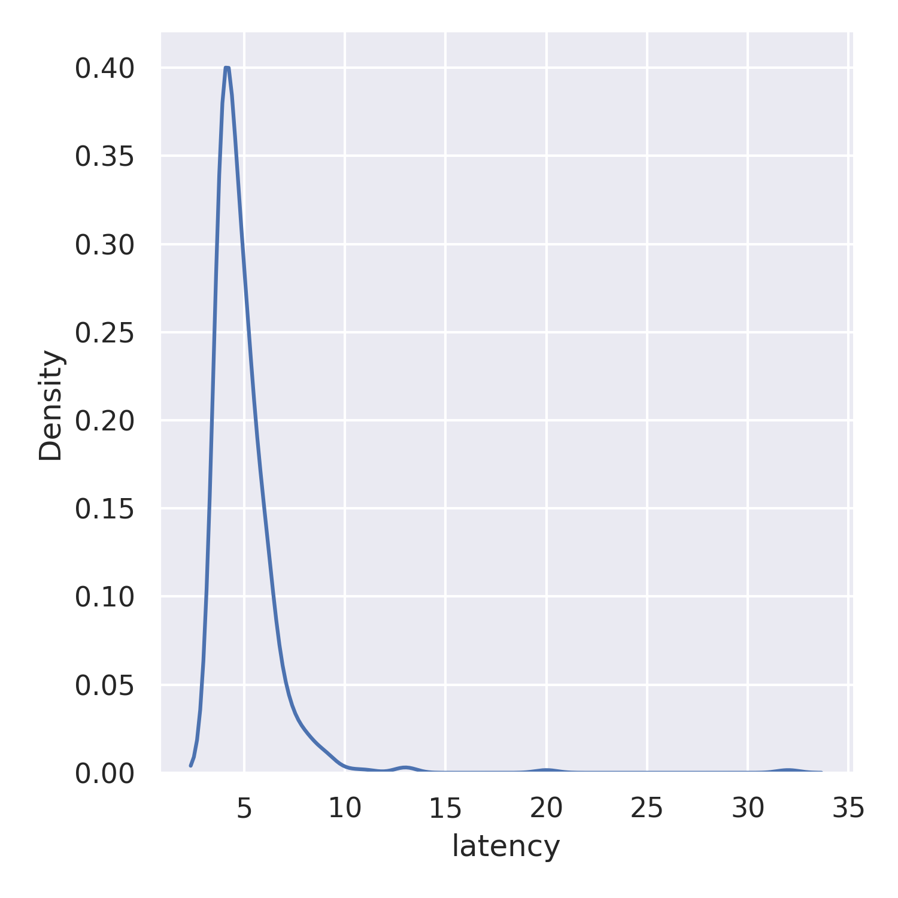

Resultados
==========

    
    Latencia "Serial Best Effort" distribución

.. figure:: jupyter_notebook/latency_serial_best-effort_hist.png 
    :width: 300px
    :align: center
    
    Latencia "Serial Best Effort" histograma

    
    Latencia "Serial Reliable" distribución

.. figure:: jupyter_notebook/latency_serial_reliable_hist.png
    :width: 300px
    :align: center
    
    Latencia "Serial Reliable" histograma

    
    Latencia "WiFi Best Effort" distribución

    
    Latencia "WiFi Best Effort" histograma

    
    Latencia "WiFi Reliable" distribución

.. figure:: jupyter_notebook/latency_wifi_reliable_hist.png
    :width: 300px
    :align: center
    
    Latencia "WiFi Reliable" histograma

latency_serial_best-effort:
---------------------------

.. table:: Valores estadísticos 
   :widths: auto
   :align: center

   =====  ==========
   Data    Value
   =====  ==========
   count  370.000000
   mean     5.551351
   std      2.950139
   min      4.000000
   25%      4.000000
   50%      5.000000
   75%      6.000000
   max     31.000000
   =====  ==========

