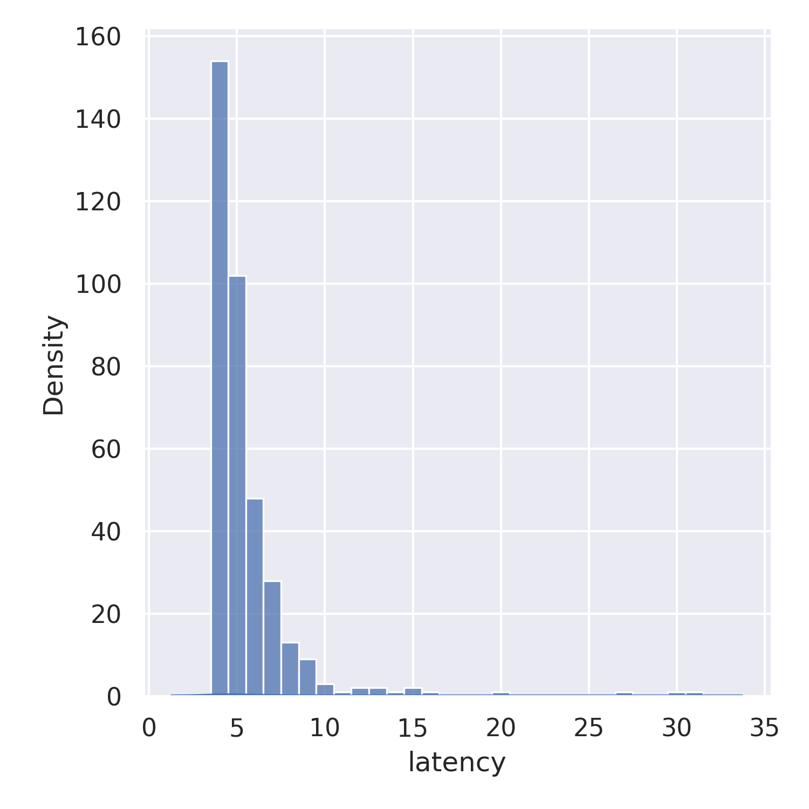
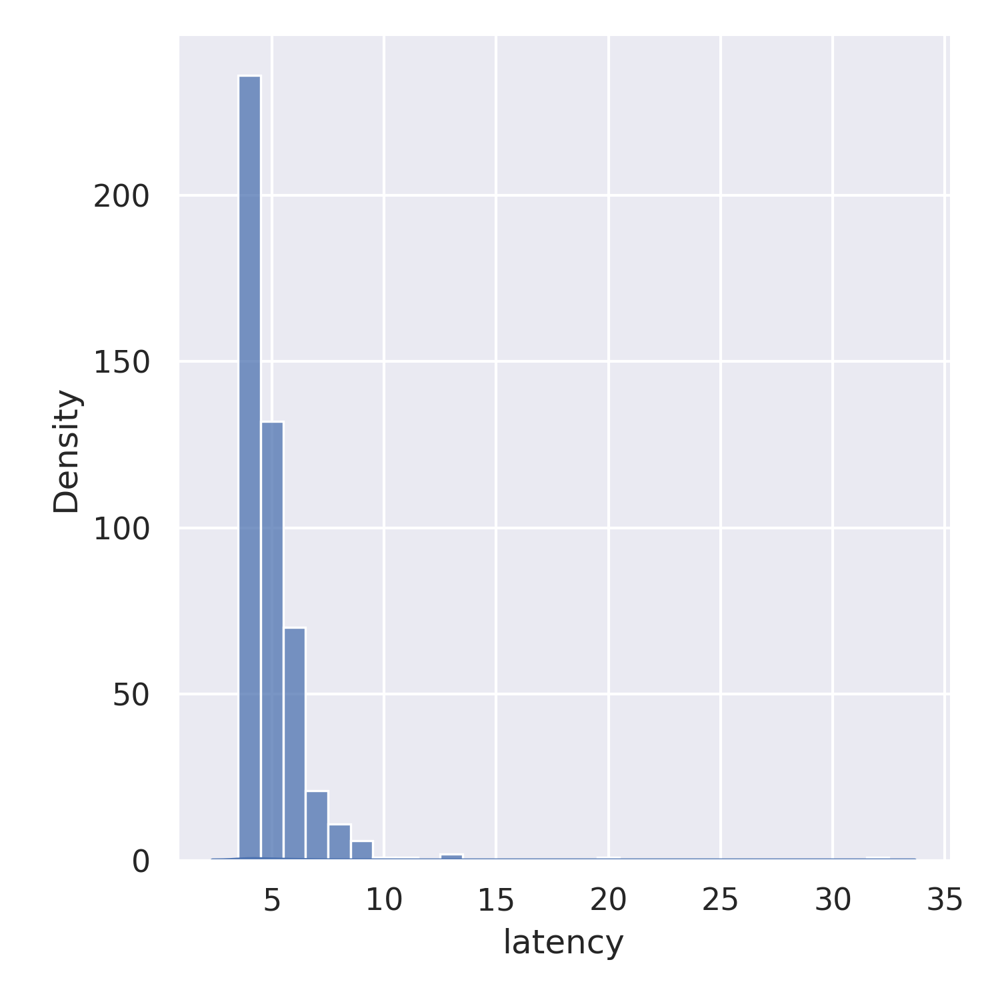

Resultados
==========

.. figure:: jupyter_notebook/latency_serial_best-effort_dist_kde.png
    :width: 300px
    :align: center
    
    Latencia "Serial Best Effort" distribución

    
    Latencia "Serial Best Effort" histograma

.. figure:: jupyter_notebook/latency_serial_reliable_dist_kde.png 
    :width: 300px
    :align: center
    
    Latencia "Serial Reliable" distribución

    
    Latencia "Serial Reliable" histograma

.. figure:: jupyter_notebook/latency_wifi_best-effort_dist_kde.png 
    :width: 300px
    :align: center
    
    Latencia "WiFi Best Effort" distribución

.. figure:: jupyter_notebook/latency_wifi_best-effort_hist.png
    :width: 300px
    :align: center
    
    Latencia "WiFi Best Effort" histograma

.. figure:: jupyter_notebook/latency_wifi_reliable_dist_kde.png
    :width: 300px
    :align: center
    
    Latencia "WiFi Reliable" distribución

    
    Latencia "WiFi Reliable" histograma

                  
