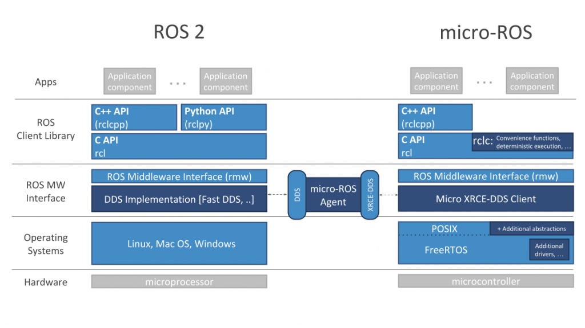
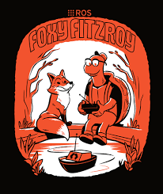
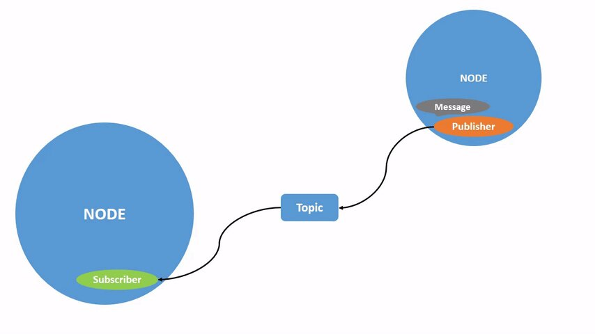
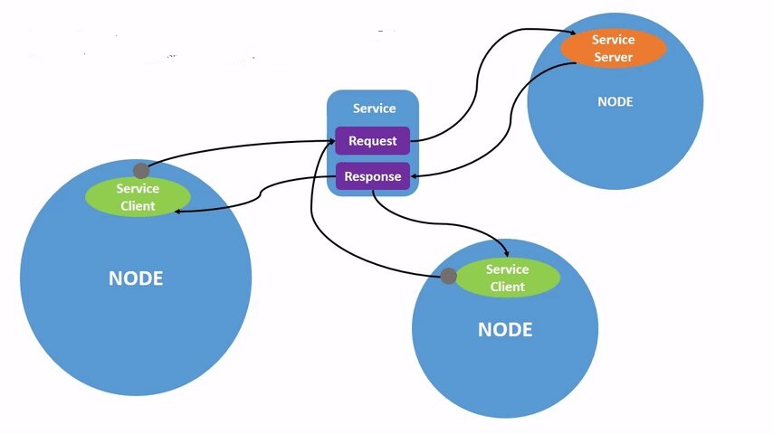
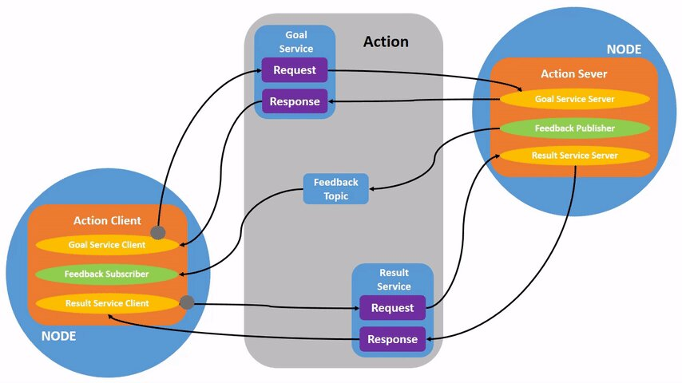
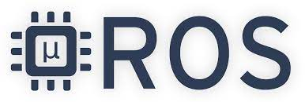
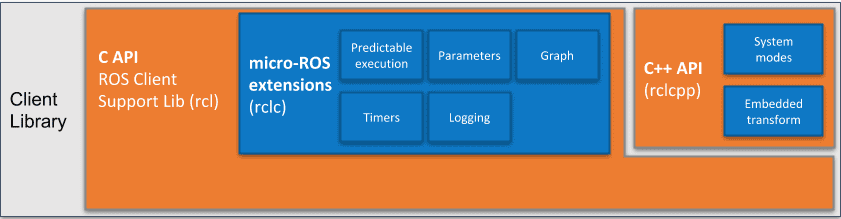
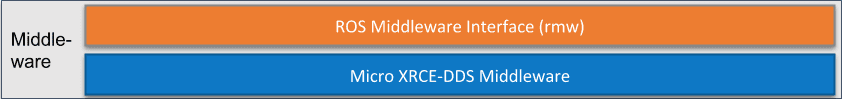
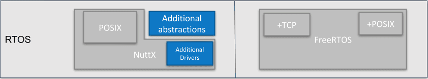

Software
========

Como ya se ha comentado anteriormente, el foco principal de
este trabajo reside en analizar las características en tiempo
real de ROS2 y micro-ROS. Sin embargo, la comunicación entre estos
sistemas operativos y los sistemas reales requiere de la
participación de otros softwares intermedios o “middlewares”
que facilitan la comunicación con el mundo real.

En este capitulo se va a explicar el software empleado para
la realización del trabajo y la instalación del mismo.

La estructura de software que más se asemeja a la empleada en el
análisis es la siguiente.

    
    Comparación de la estructura de ROS 2 y micro-ROS

ROS 2
-----

Desde que ROS comenzó en 2007, ha cambiado mucho la robótica y la propia
comunidad de ROS. Con el objetivo de adaptar esos cambios, recientemente
se ha lanzado una nueva versión de este software llamada ROS 2. Esta
recoge todo lo bueno que tenía ROS 1 y mejora aquello que se había
quedado algo obsoleto.

El software de ROS 2 se mantiene constantemente actualizado. Cada cierto
tiempo se lanza una nueva distribución, esto es, un conjunto versionado
de paquetes de ROS. Las actualizaciones se realizan de esta forma de
modo que se permite a los desarrolladores trabajar con una base de
código relativamente estable hasta que estén preparados para hacer
avanzar todo su trabajo a la siguiente distribución. Por lo tanto, una
vez que se libera una distribución, se trata de limitar los cambios a la
corrección de errores y a las mejoras que no rompan el núcleo de los
paquetes.

https://docs.ros.org/en/rolling/

Las dos distribuciones que están activas actualmente son “Foxy fitzroy”,
que fue lanzada en junio de 2020, y “Galactic Geochelone”, que es la más
reciente, lanzada en mayo de 2021.

Para la realización de este trabajo se ha escogido la distribución de
Foxy, ya que, a pesar de no ser la más novedosa, es la distribución que
da soporte al software de micro-ROS, el cual se explicará en el
siguiente apartado.

    
    Logotipo de la distribución "Foxy fitzroy"

Se pueden instalar los paquetes de ROS 2 Foxy Fitzroy tanto para Linux
(Ubuntu), Windows o MacOS. En nuestro caso se ha escogido la
distribución de Linux ya que originariamente ROS fue creada para este
sistema operativo y está más optimizada.

Conceptos
+++++++++

Para comprender el análisis llevado a cabo en este trabajo es necesario
conocer de una manera básica como funciona ROS 2. El sistema operativo
de robots funciona como un nexo entre dos o más sistemas o nodos.

Estos nodos tienen varias formas de comunicarse. La más sencilla es
mediante topics. Estos topics actúan como buses de información para
intercambiar mensajes entre nodos. Los nodos pueden actuar como
publicadores (publisher) o como suscriptores (subscribers). Los
publicadores son los encargados de publicar mensajes al topic y los
suscriptores son los que reciben esos mensajes del topic.

    
    Funcionamiento de un topic

Otra forma de comunicación entre nodos es mediante servicios. Estos
están basados en un modelo de solicitud y servicio. En este caso existe
un solo nodo que actúa como servidor (server) y uno o más nodos que
actúan como clientes (clients). Los clientes demandan un servicio y el
servidor responde con un mensaje. A diferencia de la comunicación
mediante topics, en este caso los clientes solo envían información
cuando esta ha sido pedida por otro nodo o cliente.

    
    Funcionamiento de un servicio

Finalmente, los nodos también pueden comunicarse mediante acciones.
Estas están constituidas por topics y servicios. El modelo de
comunicación es similar a la de los servicios, con la peculiaridad de
que cuentan con un tópico que actúa de feedback entre el servidor y el
cliente, y dos servicios, uno para el objetivo que quiere cumplir el
cliente (goal service) y otro para los resultados obtenidos (result
service).

    
    Funcionamiento de una acción

Por otro lado, también es posible modificar el estado de un nodo
mediante parámetros. Estos son características propias del nodo que
pueden ser modificadas por los servidores de ROS 2.

https://docs.ros.org/en/foxy/Tutorials.html

Instalación
+++++++++++

El proceso de instalación de ROS 2 se encuentra perfectamente explicado
en la documentación oficial, en la pagina web
https://docs.ros.org/en/foxy/Installation.html.

Hay dos formas de instalar los paquetes de ROS 2 para Ubuntu. A
continuación se explicará de forma resumida la instalación llevada acabo
para la realización de este trabajo.

Se ha escogido la instalación con los paquetes Debian, debido a su
sencillez y rapidez. En primer lugar es necesario asegurarse que nuestro
local soporta el formato de codificación UTF-8.

En segundo lugar es necesario añadir la herramienta avanzada de paquetes
(APT) de ROS 2 a nuestro sistema. A continuación hay que añadir el
repositorio a nuestra lista fuente.

Finalmente, se instalan los paquetes de ROS 2. Para ello hay que
actualizar la caché del repositorio de la herramienta de paquetes y ya
se podrá utilizar para realizar la instalación de escritorio, que
contiene el ROS, demos, y tutoriales; y la instalación básica que
proporciona al sistema las librerías, los paquetes con los mensajes y
las herramientas de la linea de comandos.

Por último, es importante añadir que cada vez que se vaya a utilizar ROS
2 es necesario añadir el fichero “setup.bash” a la lista fuente.

Se muestran a continuación los comandos necesarios para ejecutar dichas acciones.

::
   
 # Set locale

 locale  # check for UTF-8
 sudo apt update && sudo apt install locales
 sudo locale-gen en_US en_US.UTF-8
 sudo update-locale LC_ALL=en_US.UTF-8 LANG=en_US.UTF-8
 export LANG=en_US.UTF-8
 locale  # verify settings

 # Setup Sources

 sudo apt update && sudo apt install curl gnupg2 lsb-release
 sudo curl -sSL https://raw.githubusercontent.com/ros/rosdistro/master/ros.key  -o /usr/share/keyrings/ros-archive-keyring.gpg
 echo "deb [arch=$(dpkg --print-architecture) signed-by=/usr/share/keyrings/ros-archive-keyring.gpg] http://packages.ros.org/ros2/ubuntu $(lsb_release -cs) main" | sudo tee /etc/apt/sources.list.d/ros2.list > /dev/null

 # Install ROS 2 packages

 sudo apt update
 sudo apt install ros-foxy-desktop
 sudo apt install ros-foxy-ros-base

 #Environment setup
 
 source /opt/ros/foxy/setup.bash
https://docs.ros.org/en/foxy/Installation/Ubuntu-Install-Debians.html

Micro-ROS
---------

Micro-ROS es un framework que acerca las aplicaciones robóticas
diseñadas para infraestructuras de gran tamaño a dispositivos con
recursos limitados como son los microcontroladores. Este software lleva
la interfaz de programación de ROS a estos dispositivos y permite
integrarlos en los sistemas basados en ROS 2. La combinación entre ROS 2
y micro-ROS da como resultado un marco robótico que reduce las barreras
de entrada al mercado, reduciendo costes y acelerando el desarrollo de
robots.

    
    Logotipo de micro-ROS

La contribución de micro-ROS al mundo de la robótica va más allá. El
poder adaptar el sistema operativo de robots a sistemas embebidos
permite la interoperabilidad que exigen los sistemas robóticos
distribuidos para explotar la creciente superposición entre la robótica,
los dispositivos integrados y el IoT. De este modo, se simplifica la
construcción y el diseño de aplicaciones para sistemas robóticos de gran
tamaño, pudiendo dividirse estos en sistemas aislados más pequeños y
sencillos capaces de conectarse entre si, dotando al sistema general de
más información acerca del entorno, permitiendo que los sistemas
robóticos verdaderamente distribuidos interactúen de forma aún más
inteligente con el mundo que les rodea.

https://www.youtube.com/watch?v=slMhPRnBVwM

Características principales
+++++++++++++++++++++++++++

Micro-ROS posee siete características claves que lo convierten en un
software optimizado para microcontroladores:

-  Una API adaptada para microcontroladores que incluye todos los
   conceptos principales de ROS: este framework adaptado cuenta con las
   mismas prestaciones principales que ROS 2, como son la publicación y
   suscripción a mensajes de un tópico por parte de nodos, la mecánica
   de cliente/servicio, el ciclo de vida y el gráfico de nodos. Esta API
   se basa en la biblioteca estándar de soporte de clientes de ROS 2
   (rcl) y un conjunto de extensiones (rclc), que se explicarán
   posteriormente.

-  Integración perfecta con ROS 2: El agente de micro-ROS se conecta con
   los nodos de los microcontroladores a través de sistemas ROS 2
   estándar. Esto permite acceder a los nodos micro-ROS con las
   herramientas y APIs conocidas de ROS 2 como si se trataran de nodos
   suyos.

-  Un middleware con recursos muy limitados pero de gran flexibilidad:
   Micro-ROS utiliza Micro XRCDE-DDS de eProsima como middleware para
   sistemas embebidos. Este software es el nuevo estándar de DDS para
   entornos con recursos limitados, el cual se explicará en el siguiente
   capítulo. Para la integración con la interfaz del middleware de ROS
   (rmw) en la pila de micro-ROS, se introdujeron herramientas de
   memoria estática para evitar asignaciones de memoria dinámica en
   tiempo de ejecución.

-  Soporte de varios sistemas operativos en tiempo real con un sistema
   de compilación genérico: Otro de los softwares requeridos para la
   ejecución de programas en sistemas de tiempo real es un sistema
   operativo en tiempo real, el cual se explicará más adelante.
   Micro-ROS soporta tres populares sistemas operativos en tiempo real
   (a partir de ahora RTOS) de código abierto: FreeRTOS, Zephyr y Nuttx.
   Además puede ser portado a cualquier RTOS que tenga una interfaz
   POSIX. 
   Los sistemas de compilación específicos de RTOS están integrados en
   algunos scripts de configuración genéricos, que se proporcionan como
   un paquete de ROS 2. Además, micro-ROS proporciona herramientas
   específicas para algunos de estos RTOS.

-  Software de licencia permisiva: Micro-ROS se encuentra bajo la misma
   licencia que ROS 2, “Apache License 2.0”. Esto se aplica a la
   biblioteca del cliente de micro-ROS, la capa de middleware y las
   herramientas.

-  Comunidad y ecosistema muy activos: Micro-ROS ha sido desarrollado
   por una comunidad auto-organizada y en constante crecimiento,
   respaldada por el “Embedded Working Group”, un grupo serio de trabajo
   de ROS 2. Esta comunidad proporciona apoyo a través de GitHub y
   comparte tutoriales de nivel básico. A parte de eso, también crea
   herramientas en torno a micro-ROS para optimizar las aplicaciones ya
   creadas al hardware del microcontrolador. Estas permiten comprobar el
   uso de la memoria, el consumo de tiempo de la CPU y el rendimiento
   general.

-  Mantenibilidad e interoperabilidad a largo plazo: Micro-ROS está
   formado por varios componentes independientes. Varios RTOSes de
   código abierto con cierto renombre, un middleware estandarizado y la
   biblioteca estándar de soporte de clientes ROS 2 (rcl). De este modo
   se minimiza la cantidad de código específico de micro-ROS para su
   mantenimiento a largo plazo. Al mismo tiempo, la pila de micro-ROS
   conserva la modularidad de la pila estándar de ROS 2. Esto se traduce
   en que el software de micro-ROS no depende de si mismo para
   garantizar un buen mantenimiento, sino que está respaldado por otros
   componentes con más soporte detrás y que podrían ser sustituibles.

https://micro.ros.org/docs/overview/features/

Instalación
+++++++++++

Después de instalar ROS 2, es necesario crear un espacio de trabajo para
micro-ROS. Una vez creado, se clona el repositorio de github que
contiene las herramientas y los ficheros para instalar micro-ROS.
Finalmente, se compilan todos los ficheros y se obtendrían las
herramientas principales de micro-ROS.

:: 
 
 # Source the ROS 2 installation

 source /opt/ros/ $ROS_DISTRO /setup.bash

 # Create a workspace and download the micro-ROS tools

 mkdir microros_ws

 cd microros_ws

 git clone -b $ROS_DISTRO https://github.com/micro-ROS/micro_ros_setup.git src/micro_ros_setup

 # Update dependencies using rosdep

 sudo apt update  && rosdep update

 rosdep install --from-path src --ignore-src -y

 # Install pip

 sudo apt-get install python3-pip

 # Build micro-ROS tools and source them

 colcon build

 source install /local_setup.bash

https://micro.ros.org/docs/tutorials/core/first_application_linux/

Arquitectura modular
++++++++++++++++++++

Micro-ROS sigue la arquitectura de ROS 2, y aprovecha su capacidad de
conexión del middleware para utilizar el DDS para microcontroladores
(DDS-XRCE). Además utiliza los RTOS basados en POSIX en lugar
de Linux.

.. figure:: Fotos/estructura_micro_ros.png
    :width: 150px
    :align: center
    
    Estructura de micro-ROS

A continuación se procederá a explicar los componentes que forman la
arquitectura de Micro-ROS divididos en tres grupos: librería del
cliente, middleware y RTOS.

Librería del cliente
++++++++++++++++++++

El objetivo general de esta librería es proporcionar todos los conceptos
relevantes de ROS 2 en implementaciones adecuadas para
microcontroladores y posteriormente lograr la compatibilidad de la API
con ROS 2 para facilitar la portabilidad. Para minimizar el coste de
mantenimiento a largo plazo, se trata de utilizar las estructuras de
datos y los algoritmos existentes de la pila de ROS 2, o bien introducir
los cambios necesarios en la pila principal. Esto genera una
preocupación por la dudosa aplicabilidad de las capas existentes de ROS
2 en los microcontroladores en términos de eficiencia en tiempo de
ejecución, la portabilidad a diferentes RTOS, la gestión de memoria
dinámica, etc.

C es el lenguaje de programación dominante en los microcontroladores,
sin embargo, existe una clara tendencia a utilizar lenguajes de alto
nivel, especialmente C++, debido a que los microcontroladores más
modernos ya cuentan hasta con algunos megabytes de RAM. Es por ello por
lo que micro-ROS pretende ofrecer y soportar dos APIs.

-  La API en C basada en la librería de soporte de ROS 2 (rcl): Esta API
   está formada principalmente por paquetes modulares para el
   diagnóstico, la gestión de la ejecución y los parámetros.

-  La API en C++ basada en la rclcpp de ROS 2: Esta API en cambio,
   requiere primero de la aptitud de rclcpp para su uso en
   microcontroladores, en particular cuando se trata de la memoria, el
   consumo de CPU y la gestión de la memoria dinámica. Esta incluye las
   estructuras de datos relacionadas con la generación de mensajes como
   pueden ser los topics, los servicios y las acciones.

Dentro de estas APIs existen paquetes diseñados específicamente para
micro-ROS. La librería rclc cuenta con numerosas extensiones dedicadas a
microcontroladores. Cuenta con funciones como temporizadores, logging,
gráficos específicos, modificación de parámetros, etc.

Además de estas aplicaciones, se han desarrollado varios conceptos
avanzados en el contexto de la librería del cliente. En general, estos
conceptos se desarrollan primero para el rclcpp estándar antes de
implementar una versión en C adaptada. Estas funciones son las
siguientes:

-  Ejecutor en tiempo real: El objetivo de este módulo consiste en
   aportar mecanismos de tiempo real prácticos y fáciles de usar que
   proporcionen soluciones para garantizar los requisitos de tiempo
   demandados. También pretende integrar funcionalidades de tiempo real
   o no real en una plataforma de ejecución y soporte específico para
   RTOS y microcontroladores.

-  Ciclo de vida y modos del sistema: En micro-ROS se ha detectado que
   el entrelazamiento de la gestión de tareas, la gestión de imprevistos
   y la gestión de errores del sistema, que se manejan en la capa de
   deliberación generalmente conduce a la alta complejidad del flujo de
   control, algo que podría reducirse introduciendo abstracciones
   adecuadas para las llamadas y notificaciones orientadas al sistema.
   El objetivo de esta funcionalidad reside en proporcionar
   abstracciones y funciones marco adecuadas para la configuración del
   tiempo de ejecución del sistema y el diagnóstico de errores y
   contingencias del sistema.

-  Transformación integrada: El gráfico de transformación es una
   herramienta que, desde su lanzamiento, ha sido fundamental para los
   marcos de trabajo de robótica. Sin embargo, un problema persistente
   ha sido su alto consumo de recusos. Micro-ROS ejecuta el árbol de
   transformación dinámico en un dispositivo integrado, manteniendo el
   uso de recursos al mínimo, basándose en un análisis de los detalles
   espaciales y temporales que realmente necesitan.

\ https://www.fiware.org/2020/06/02/two-layered-api-introducing-the-micro-ros-client-library/

    
    Arquitectura de la librería del cliente

Middleware
++++++++++

La principal característica de los softwares de robots es la
comunicación entre distintos nodos que permita el intercambio de
información con unas características determinadas.

Para implementar todos esos conceptos de comunicación, en ROS 2 se
decidió hacer uso de un middleware ya existente llamado DDS. De esta
forma, ROS 2 puede aprovechar una implementación enfocada en ese sector
ya existente y bien desarrollada.

    
    Arquitectura del middleware

https://design.ros2.org/articles/ros_middleware_interface.html

DDS son las siglas de Data Distribution Service. Es un servicio de
distribución de datos que sirve como estándar de comunicación de
sistemas en tiempo real para los middlewares de tipo publish/subscribe,
como puede ser ROS. Fue creado debido a la necesidad de estandarizar los
sistemas centrados en datos.

`https://es.wikipedia.org/wiki/Data_Distribution_Servic <https://es.wikipedia.org/wiki/Data_Distribution_Service>`__

Existen numerosas implementaciones distintas de DDS y cada una tiene sus
ventajas y sus desventajas en términos de plataformas soportadas,
rendimiento, licencias, dependencias y huellas de memoria. Es por ello
por lo que ROS pretende soportar múltiples implementaciones DDS a pesar
de que cada una de ellas difiera ligeramente en su API. Para abstraerse
de dichas especificaciones, se ha introducido una interfaz abstracta que
puede ser implementada para diferentes DDS. Esta interfaz de middleware
define la API entre la librería del cliente de ROS y cualquier
implementación específica.

Como ya se ha comentado en el anterior párrafo, ROS 2 da soporte a
varias DDS. La más utilizada y considerada la DDS por defecto es la
“Fast DDS” de eProsima. Esta implementación está diseñada en C++ e
implementa el protocolo RTPS (Real Time Publish Subscribe), el cual
permite comunicaciones a través de distintos medios como el protocolo de
datagrama de usuario (UDP), un protocolo ligero de transporte de datos
que funciona sobre IP.

https://www.eprosima.com/index.php/products-all/eprosima-fast-dds

https://es.khanacademy.org/computing/ap-computer-science-principles/the-internet/x2d2f703b37b450a3:transporting-packets/a/user-datagram-protocol-udp#:~:text=El%20Protocolo%20de%20datagrama%20de,o%20llegan%20fuera%20de%20orden.

Para adaptar todo este mecanismo de comunicación a Micro-ROS, eProsima
ha desarrollado “Micro XRCE-DDS”. Esta adaptación permite comunicar
entornos con recursos extremadamente limitados (eXtremely Resource
Constrained Environments, XRCE) con una red existente de DDS. La
librería Micro XRCE-DDS implementa un protocolo de cliente/servidor que
permite a los microcontroladores participar en comunicaciones de DDS. El
agente de Micro XRCE-DDS actúa como un puente entre el cliente y el
espacio de datos de DDS y permite a estos dispositivos actuar como
publicadores y suscriptores o como clientes y servidores.

.. figure:: Fotos/xrcedds_architecture.png
    :width: 150px
    :align: center
    
    Arquitectura de Micro XRCDE-DDS

Dentro de las características principales de Micro XCRE-DDS, caben
destacar las siguientes: 
      
-  Alto rendimiento: El cliente utiliza una librería de serialización
   de bajo nivel que codifica en XCDR.
      
-  Bajo consumo de recursos: La librería del cliente está libre de memoria
   XRCDE-DDS dinámica y estática, por lo que la única huella de memoria se
   debe al crecimiento de la pila. Puede gestionar un emisor/suscriptor simple
   con menos de 2 kB de RAM. Además el cliente está construido según un
   concepto de perfiles, lo que permite añadir o eliminar funcionalidades a la
   librería al mismo tiempo que modifica su tamaño.
      
   Multiplataforma: Las dependencias del sistema operativo son módulos aditivos,
   por lo que los usuarios pueden implementar los módulos específicos de cada
   plataforma a la librería del cliente. Por defecto, el sistema permite
   trabajar con los sistemas operativos estándar Windows y Linux, y con los
   RTOS Nuttx, FreeRTOS y Zephyr.
      
-  Multitransporte: A diferencia de otros middlewares de transferencia de datos,
   XRCE-DDS soporta múltiples protocolos de transporte de forma nativa. En
   concreto, es posible utilizar los protocolos UDP, TCP o un protocolo de
   transporte en serie personalizado.
      
-  De código abierto: La librería del cliente, el ejecutable del agente,
   la herramienta de compilación y otras dependencias internas son libres y de
   código abierto.

-  Dos modos de funcionamiento: Micro XRCE-DDS soporta dos modos de 
   funcionamiento. El modo “best-effort” implementa una comunicación
   rápida y ligera, mientras que el modo “reliable” asegura la fiabilidad
   independientemente de la capa de transporte utilizada.

RTOS
++++

Como ya se ha explicado previamente, RTOS significa sistema operativo en
tiempo real. Esto es un sistema operativo ligero que se emplea para facilitar
la multitarea y la integración de tareas en sistemas con recursos y tiempo
limitados. La clave de un RTOS es la previsibilidad y el determinismo en el
tiempo de ejecución más que la inmediatez, ya que lo fundamental en un
sistema que opera de este modo es que realice una serie de tareas en un tiempo
determinado, y no necesariamente lo más rápido posible.

https://www.digikey.es/es/articles/real-time-operating-systems-and-their-applications

    
    Arquitectura del RTOS

Un sistema operativo de este tipo cuenta con las siguientes características:
no utiliza gran cantidad de memoria, es susceptible de actuar tras eventos
realizados en el soporte físico, un tiempo de respuesta predecible, fiabilidad
y multi-arquitectura, esto es la posibilidad de portar el código a cualquier
tipo de CPU.

https://es.wikipedia.org/wiki/Sistema_operativo_de_tiempo_real

Los RTOS suelen utilizar capas de abstracción de hardware que facilitan
el uso de recursos del hardware, como temporizadores y buses de comunicación,
aligerando el desarrollo y permitiendo la reutilización de código.
Además, ofrecen entidades de hilos y tareas que proporcionan las
herramientas necesarias para implementar el determinismo en las aplicaciones.
La programación consta de diferentes algoritmos, entre los que mejor se adapten
a sus aplicaciones.

Debido a todos los beneficios que ofrecen estos sistemas operativos,
micro-ROS los integra en su pila de software. Esto mejora las capacidades
de micro-ROS Y permite reutilizar todas las herramientas y funciones
proporcionadas por estos.

Al igual que los sistemas operativos convencionales, los RTOS también
tienen diferentes soportes para las interfaces estándar. Esto se establece
en una familia de estándares denominada POSIX. Este  está basado en Linux,
el sistema operativo nativo de ROS 2, por lo que la portabilidad de gran parte
del código de este a micro-ROS se facilita empleando los RTOS de este grupo.
Tanto NuttX como Zephyr cumplen en buena medida con los estándares POSIX,
haciendo que el esfuerzo de portabilidad sea mínimo, mientras que FreeRTOS
proporciona un plugin, FreeRTOS+POSIX, gracias al cual una aplicación
existente que cumpla con POSIX puede ser fácilmente portada al ecosistema
FreeRTOS.

https://micro.ros.org/docs/concepts/rtos/

A pesar de que todos utilizan el mismo código base de micro-ROS y que
sus herramientas han sido integradas en el sistema de compilación de ROS 2,
existen notables diferencias en sus características.

https://micro.ros.org/docs/tutorials/core/first_application_rtos/

A la hora de escoger un RTOS aparecen varios factores a tener en cuenta.
La responsabilidad y exposición legal, el rendimiento, las características
técnicas, el coste, el ecosistema, el middleware a emplear, el proveedor
y la preferencia de ingeniería.

https://www.digikey.com/en/articles/how-to-select-the-right-rtos-and-microcontroller-platform-for-the-iot

FreeRTOS ha sido el sistema operativo en tiempo real escogido para la
realización de este análisis, debido a que es el que mejor se adapta a la placa
que se usará en el mismo. Este es distribuido bajo la licencia MIT. Las
propiedades clave de este RTOS son las herramientas de gestión de memoria
que contiene, los recursos de transporte que ofrece, TCP/IP y IwIP, las tareas
estándar y ociosas disponibles con prioridades asignables, la disponibilidad
de la extensión POSIX y el tamaño tan reducido que ocupa, permitiendo ser
utilizada en prácticamente cualquier microcontrolador.

https://micro.ros.org/docs/overview/rtos/#freertos

    
    Logotipo de FreeRTOS